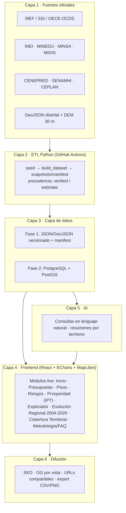
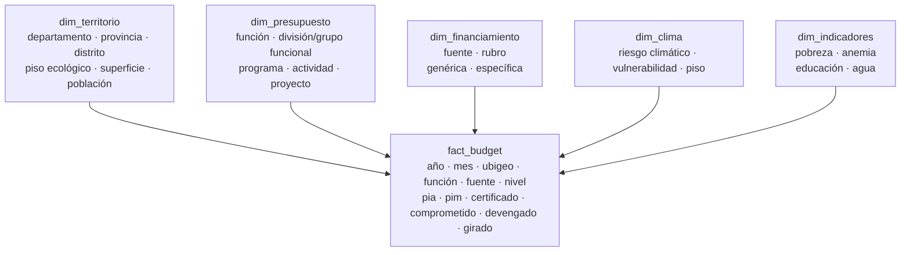
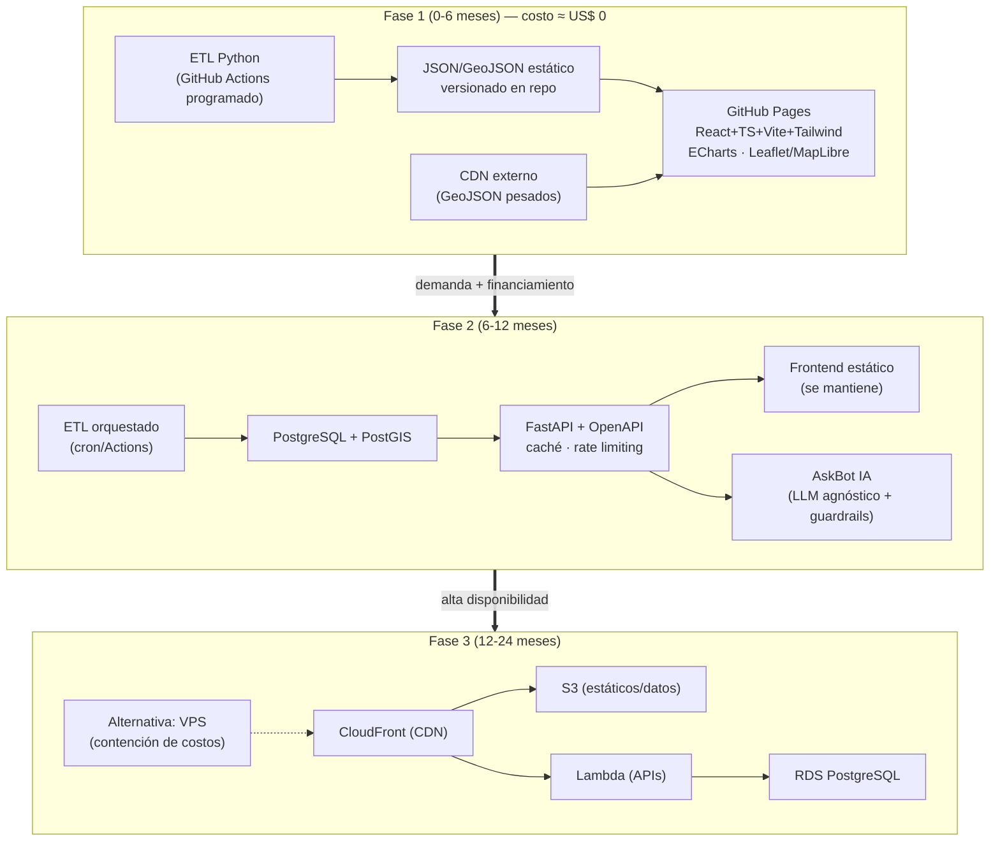
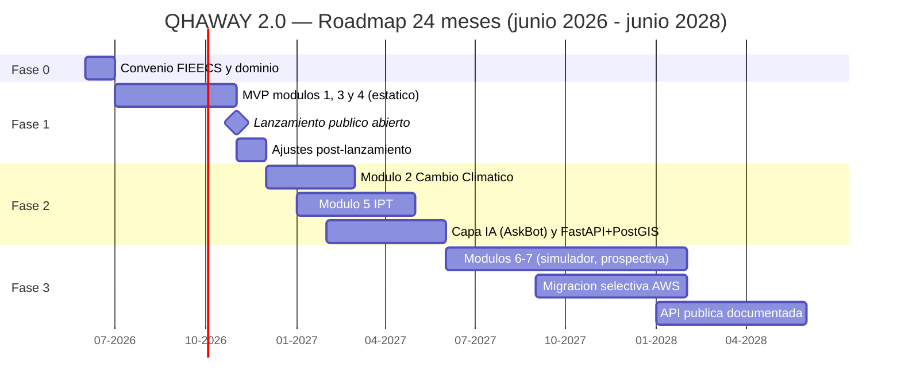

# 1. Resumen Ejecutivo

En abril de 2024 la FIEECS-UNI lanzó **QHAWAY, Observatorio del Presupuesto Público del Perú**, una apuesta pionera por poner datos fiscales al servicio de la docencia, la investigación y la incidencia pública[^res-fieecs]. El dashboard llegó a operar con cuatro tableros (ejecución presupuestal MEF, inversión verde, transporte e indicadores del Estado), con desagregación hasta nivel provincial[^res-wayback]. Hoy ese dashboard está fuera de línea: el dominio y el hosting pagados caducaron, el acceso exigía registro previo y no existían URLs compartibles ni posicionamiento en buscadores. La lección no es de concepto —la idea era correcta— sino de **sostenibilidad técnica y de costos**.

Esta propuesta plantea relanzar la marca como **QHAWAY 2.0 — Observatorio Nacional de Inteligencia Territorial, Presupuesto Público, Cambio Climático, Riesgos y Desarrollo Humano**, sobre una base ya demostrada: el proponente técnico, Carlos Cárdenas Fernández, egresado UNI, mantiene en producción siete observatorios de datos públicos de acceso abierto —más un octavo en repositorio pre-publicación—, a nivel distrital y con costo de infraestructura de US$ 0, entre ellos Perú Transparente, Proyecto INTI (1,891 distritos georreferenciados) y Perú Riesgos[^res-activos]. QHAWAY 2.0 no parte de cero: reutiliza componentes operativos y los pone bajo el respaldo institucional de la FIEECS-UNI.

El observatorio **ya está live y navegable** en <https://unimauro.github.io/qhaway-dashboard/> con un **menú de once módulos operativos**: 🏠 Inicio · 🏛 Presupuesto Público · 🗺 Pisos Altitudinales · ⚠️ Riesgos Territoriales · 📊 Prosperidad (IPT) · 🌡 Cambio Climático · 🔍 Explorador Multidimensional · 🧊 Cubo Presupuestal (OLAP en vivo) · 📈 Evolución Regional 2004-2026 · 🧭 Cobertura Territorial · 📚 Metodología y FAQ. A estos módulos entregados, la propuesta suma una agenda de módulos **propuestos** para la Fase 3 (Simulador de Políticas, Prospectiva 2030/2040/2050 y Laboratorio Académico FIEECS), claramente marcados como tales.

**Módulos entregados (live hoy):**

| # | Módulo | Qué responde |
|---|---|---|
| 1 | 🏠 Inicio | KPIs nacionales y tendencia del presupuesto público a lo largo de 22 años |
| 2 | 🏛 Presupuesto Público | PIA/PIM/Devengado/Girado por distrito (15 años 2012-2026), función, sector y nivel, con Sankey, treemap y evolución mensual |
| 3 | 🗺 Pisos Altitudinales | Composición de cada distrito según las 8 regiones naturales; % población vs. % presupuesto y per cápita por piso |
| 4 | ⚠️ Riesgos Territoriales | Exposición a peligros por región, cruzada con territorio |
| 5 | 📊 Prosperidad (IPT) | Índice de Prosperidad Territorial por distrito (educación, salud, economía, servicios) |
| 6 | 🌡 Cambio Climático | Inversión ambiental/climática (proxy por función) territorializada + cruce riesgo climático vs. inversión per cápita |
| 7 | 🔍 Explorador Multidimensional | Cruza función/fuente × territorio × nivel, con atribución por destino (META) vs. ejecutora y cobertura de datos |
| 8 | 🧊 Cubo Presupuestal (OLAP) | Pivote 2D en vivo: cruza función/fuente × nivel/departamento × PIM/devengado, calculado por la API en tiempo real |
| 9 | 📈 Evolución Regional 2004-2026 | Presupuesto por departamento para cada uno de 22 años: mapa por año, ranking y serie temporal por departamento |
| 10 | 🧭 Cobertura Territorial | Tres estados del dato ("con dato" / "sin dato" / "no existía") y timeline de demarcación de distritos |
| 11 | 📚 Metodología y FAQ | Glosario, guía de gráficos, presentación de la marca y la nota del vacío de datos distritales por destino |

A ello se suman, de forma transversal, **Ninacha** —el asistente de IA flotante del observatorio (motor híbrido de costo casi nulo, §7.4)—, un **buscador global** (Ctrl+K) y modo oscuro. Los módulos **propuestos** para la Fase 3 —Simulador de Políticas Públicas, Prospectiva y Escenarios 2030/2040/2050, y Laboratorio Académico FIEECS— se describen en §8 y se ordenan en el roadmap de §9.

El **diferencial estrella** frente al portal del MEF es el **Explorador Presupuestal Multidimensional** (módulo 8, §8.8): un "cubo presupuestal" que permite navegar desde lo nacional hasta el proyecto específico cruzando dimensiones —presupuesto × cambio climático × riesgos × pobreza × piso altitudinal— para responder, por ejemplo, qué distritos suman alta vulnerabilidad climática, alta pobreza y baja inversión pública. Ninguna plataforma pública peruana ofrece hoy ese cruce integrado. A ello se suma el **diferencial territorial** de los pisos altitudinales (módulo 5): cruzando los límites distritales con un modelo digital de elevación (SRTM/Copernicus 30 m), cada distrito se descompone porcentualmente en las ocho regiones naturales de Javier Pulgar Vidal (Chala, Yunga, Quechua, Suni, Puna, Janca, Selva Alta, Selva Baja)[^res-pulgar], lo que permite responder ¿cuánto presupuesto recibe la puna?, ¿cuánta inversión climática llega a los territorios amazónicos o a los distritos más vulnerables a heladas?

> **QHAWAY no replica la Consulta Amigable del MEF. QHAWAY transforma la información presupuestal en inteligencia territorial**, mediante la integración de presupuesto, inversión pública, riesgos, cambio climático, desarrollo humano y prospectiva. El MEF muestra *dónde está el dinero*; QHAWAY explica *qué significa ese dinero para el desarrollo de los territorios*.

Un ejemplo concreto del salto de valor: en el SIAF, el presupuesto del Gobierno Nacional aparece —si se mira por unidad ejecutora— concentrado en Lima (S/ 145.5 mil millones de PIM 2025 frente a montos ínfimos en el resto). Pero esos proyectos están georreferenciados a su **destino territorial** (campo `DEPARTAMENTO_META`): leído así, el mismo presupuesto nacional se redistribuye realmente entre regiones —Cusco S/ 4.3 mil M, Áncash S/ 3.6 mil M, Piura S/ 3.4 mil M, Puno S/ 2.9 mil M, Cajamarca S/ 2.8 mil M…[^res-meta]. QHAWAY hace visible esa atribución territorial real, que el portal del MEF no expone de forma directa: es la diferencia entre saber *quién administra* el dinero y saber *a qué territorio llega*.

La propuesta no es teórica: **las Fases 1 y 2 ya están operativas y son verificables hoy** en <https://unimauro.github.io/qhaway-dashboard/>[^res-fase1], con datos reales del SIAF-MEF: el **detalle presupuestal a nivel distrital de los 15 ejercicios 2012-2026** (≈ 1,890 distritos por año, de S/ 122 mil M en 2012 a S/ 272 mil M en 2025), **cargado y conciliado** contra el total nacional, más una **serie nacional y regional 2004-2026 (22 años)** del presupuesto por destino territorial. Todo ello servido por un **backend propio (FastAPI + PostgreSQL) en producción** (`qhaway.tunky.net`, con API pública documentada) y con respaldo automático a datos estáticos. Operan ya los once módulos del menú —incluidos **Cambio Climático**, el **Cubo OLAP en vivo**, **Evolución Regional 2004-2026** y **Cobertura Territorial**—, el asistente Ninacha y el buscador global.

La implementación se escalona en **tres fases**: la Fase 1 (0-6 meses) entrega el observatorio completo como sitio estático en GitHub Pages con ETL en Python, **con costo de infraestructura ≈ US$ 0** —el mismo patrón ya probado en los observatorios live del equipo—; la Fase 2 (6-12 meses) **ya está operativa** —backend FastAPI + PostgreSQL en producción, detalle distrital de 15 años cargado y conciliado, API pública documentada (OpenAPI), Cubo OLAP en vivo y el asistente Ninacha—; la Fase 3 (12-24 meses) escala a nube AWS con CDN e infraestructura como código, con alternativa de contención de costos documentada. La plataforma integrará 14+ fuentes oficiales, entre ellas MEF Consulta Amigable, INEI, MINEDU-ESCALE, MINSA, CENEPRED-SIGRID, SENAMHI, CEPLAN y la API OCDS del OECE[^res-fuentes].

**El pedido concreto a la FIEECS-UNI** es de respaldo, no de presupuesto de infraestructura: (i) **respaldo institucional** del Decanato para que QHAWAY 2.0 sea el observatorio oficial de la Facultad; (ii) **dominio y presencia web institucional** (subdominio bajo fieecs.uni.edu.pe o equivalente, evitando la dependencia de dominios pagados que ya costó la caída del original); y (iii) **equipo académico**: docentes e investigadores que validen metodologías, y estudiantes de Ingeniería Económica y Estadística que participen vía cursos, tesis y prácticas. La Fase 1 es demostrable en seis meses sin inversión en servidores.

Tres cifras resumen la ambición: el marco territorial oficial del INEI —**1,845 distritos, 195 provincias y 24 departamentos más la Provincia Constitucional del Callao**[^res-inei]— como universo de cobertura (el dataset cartográfico vigente cubre 1,834 de esos 1,845 distritos, y la plataforma indica con honestidad los que faltan); **8 pisos altitudinales** como lente de análisis inédito del presupuesto; y **14+ fuentes oficiales** integradas en una sola plataforma abierta.

[^res-fieecs]: FIEECS-UNI, anuncio del observatorio QHAWAY (abril de 2024): <https://fieecs.uni.edu.pe/qhaway-observatorio-del-presupuesto-publico-del-peru/>
[^res-wayback]: Snapshot del dashboard original en Wayback Machine (30-nov-2024): <https://web.archive.org/web/20241130224308/https://dashboard.qhaway-fieecs.pe/>
[^res-activos]: Activos en producción del equipo proponente: Perú Transparente (<https://unimauro.github.io/peru-transparente>), Proyecto INTI (<https://unimauro.github.io/proyecto-inti>), Perú Riesgos (<https://unimauro.github.io/unimaurox-peru-riesgos>), entre otros detallados en la sección de diagnóstico.
[^res-pulgar]: Javier Pulgar Vidal, *Las ocho regiones naturales del Perú* (1941). DEM de referencia: SRTM/Copernicus 30 m, <https://dataspace.copernicus.eu/>
[^res-meta]: Cifras verificadas sobre la API de Datos Abiertos del MEF (Consulta del Gasto Público, SIAF), ejercicio 2025, comparando la agregación por `DEPARTAMENTO_EJECUTORA` (ubicación de la unidad ejecutora) frente a `DEPARTAMENTO_META` (destino territorial del proyecto): <https://datosabiertos.mef.gob.pe/dataset/presupuesto-y-ejecucion-de-gasto>
[^res-fuentes]: Principales fuentes: MEF Transparencia Económica (<https://apps5.mineco.gob.pe/transparencia/mensual/>), INEI (<https://www.inei.gob.pe>), MINEDU-ESCALE (<https://escale.minedu.gob.pe>), CENEPRED-SIGRID (<https://sigrid.cenepred.gob.pe>), SENAMHI (<https://www.senamhi.gob.pe>), CEPLAN (<https://www.ceplan.gob.pe>), API OCDS del OECE (<https://contratacionesabiertas.oece.gob.pe>). Listado completo en la sección de fuentes de datos.
[^res-fase1]: Dashboard QHAWAY 2.0 — Fase 1, en línea y navegable con datos reales del SIAF-MEF 2025: <https://unimauro.github.io/qhaway-dashboard/>.
[^res-inei]: Demarcación político-administrativa oficial del Perú según el INEI: 24 departamentos más la Provincia Constitucional del Callao, 195 provincias y 1,845 distritos; cartografía y demarcación distrital del INEI: <https://www.inei.gob.pe>. El dataset cartográfico vigente de la plataforma cubre 1,834 de esos 1,845 distritos, brecha que el observatorio declara explícitamente.


## 1.1 Alcances culminados (estado de avance a junio de 2026)

Lo que sigue ya está **entregado y verificable en línea** —no es plan, es producto—. Las Fases 1 y 2 del roadmap (§9) están operativas.

**Plataforma y módulos**

- ✅ Dashboard público *live*, sin login y con URLs compartibles: <https://unimauro.github.io/qhaway-dashboard/>
- ✅ **Once módulos operativos**: Inicio · Presupuesto Público · Pisos Altitudinales · Riesgos Territoriales · Prosperidad (IPT) · Cambio Climático · Explorador Multidimensional · Cubo Presupuestal (OLAP en vivo) · Evolución Regional 2004-2026 · Cobertura Territorial · Metodología y FAQ.
- ✅ Asistente de IA **Ninacha** (motor híbrido de costo casi nulo), buscador global (Ctrl+K) y modo oscuro.

**Datos**

- ✅ **Detalle presupuestal distrital de los 15 ejercicios 2012-2026** (~1,890 distritos por año), cargado y **conciliado al céntimo** contra el total nacional en todos los cortes (función, sector, nivel de gobierno, distrito), con la única salvedad declarada de 2012 (§9.1).
- ✅ Serie nacional y regional por destino territorial 2004-2026 (22 años), vía scraper propio de la Consulta Amigable del MEF.
- ✅ Inversión ambiental/climática (proxy por función: Ambiente, Saneamiento, Agropecuaria, Energía) para los 15 años.

**Backend y API (Fase 2, operativa)**

- ✅ Backend **FastAPI + PostgreSQL** en producción (HTTPS) en <https://qhaway.tunky.net>, consumido por el dashboard con respaldo automático a datos estáticos.
- ✅ Seguridad: CORS restringido, límite de tasa por IP, solo lectura, base de datos no expuesta y clave de IA oculta en el servidor.
- ✅ **API pública documentada** (OpenAPI): Swagger <https://qhaway.tunky.net/docs> y ReDoc <https://qhaway.tunky.net/redoc> — entregable académico reutilizable por terceros.
- ✅ **Cubo OLAP en vivo** (`/api/cubo-pivot`): pivote 2D (función/fuente × nivel/departamento × PIM/devengado) calculado en tiempo real.

**Rigor y reproducibilidad**

- ✅ Pipeline ETL reproducible (Python, público) con migración paralela y **prueba de conciliación**; cada cifra es reconstruible desde la fuente primaria.

Lo **pendiente** —Simulador de Políticas, Prospectiva 2030/2040/2050, Laboratorio Académico FIEECS, el etiquetado climático fino por marcadores de Río y la migración selectiva a nube— corresponde a la **Fase 3** y se ordena en el roadmap (§9).

# 2. Diagnóstico

## 2.1 El QHAWAY original (2024): un mérito que debe reconocerse

En abril de 2024, la FIEECS-UNI anunció QHAWAY, el "Observatorio del Presupuesto Público del Perú", concebido como herramienta de docencia, investigación e incidencia pública[^diag-fieecs]. Fue una apuesta institucional valiosa y, en varios sentidos, pionera dentro de la universidad pública peruana: pocas facultades del país han intentado convertir los datos del MEF en un producto digital propio, con identidad de marca y vocación ciudadana.

La evidencia archivada del dashboard —snapshot de Wayback Machine del 30 de noviembre de 2024[^diag-wayback]— permite documentar con precisión lo que QHAWAY logró construir:

- **Cuatro tableros temáticos**: (1) Gastos MEF — Ejecución Presupuestal, (2) Inversión Verde — Impacto en el Cambio Climático, (3) Inversión en Transporte — Gobernanza del transporte urbano, y (4) Métricas del Estado — Densidad del Estado. La inclusión temprana de un tablero de inversión verde anticipó una agenda que QHAWAY 2.0 retoma como módulo central.
- **Vista territorial** de "Presupuesto por departamento y provincia 2023" (por ejemplo, Ucayali con sus cuatro provincias).
- **Glosario pedagógico** de PIA, PIM y Girado con enlaces directos al MEF: un gesto de alfabetización presupuestal coherente con la misión docente de la FIEECS.
- **Talleres participativos de diseño** con la comunidad académica, que dieron legitimidad al proyecto y dejaron capacidades instaladas en estudiantes y docentes.

Este diagnóstico parte, por tanto, del reconocimiento: QHAWAY validó la hipótesis de que existe demanda académica y ciudadana por un observatorio presupuestal con sello FIEECS-UNI. Lo que falló no fue la idea, sino decisiones técnicas y de sostenibilidad específicas e identificables.

## 2.2 Por qué quedó offline: cinco decisiones técnicas reversibles

El dominio `dashboard.qhaway-fieecs.pe` se encuentra hoy caído; solo sobrevive el snapshot archivado. Las causas son concretas y, lo más importante, todas tienen solución probada:

1. **Login obligatorio.** El dashboard exigía registro e inicio de sesión para ver cualquier dato. Para un observatorio de incidencia pública esto invierte la lógica del producto: el dato público quedaba detrás de una puerta, lo que reduce drásticamente el alcance, impide el enlace desde prensa o redes y desincentiva la visita casual.
2. **Alcance territorial limitado a provincia.** La unidad de decisión presupuestal más cercana al ciudadano es el distrito (1,891 distritos), pero QHAWAY se detenía en el nivel departamento/provincia, insuficiente para responder las preguntas que realmente moviliza la ciudadanía.
3. **Sin SEO ni URLs compartibles.** Al no existir URLs públicas por vista ni metadatos (Open Graph, schema.org), el observatorio era invisible para buscadores y no podía circular en redes sociales: cada gráfico era un callejón sin salida comunicacional.
4. **Costos recurrentes de dominio y hosting.** La arquitectura dependía de un dominio `.pe` y un hosting pagados; cuando caducaron, el proyecto desapareció íntegro. Un observatorio universitario no puede depender de renovaciones presupuestales menores para existir.
5. **Dependencia de mantenimiento activo.** Sin pipeline automatizado de datos ni infraestructura estática, el sistema requería operación humana continua; al diluirse el equipo inicial, no hubo mecanismo de degradación elegante: pasó de operativo a inexistente.

Ninguna de estas causas es estructural. La lección central —que la sostenibilidad técnica y de costos es tan importante como el contenido— es precisamente el punto de partida de QHAWAY 2.0.

## 2.3 QHAWAY 2024 frente al ecosistema actual del equipo proponente

El equipo proponente no ofrece promesas: ofrece productos en línea, verificables hoy por cualquier lector con un navegador. La comparación es directa:

| Criterio | QHAWAY 2024 | Ecosistema actual del equipo |
|---|---|---|
| Estado | Offline (solo archivo Wayback) | 7 observatorios live + 1 en repositorio |
| Acceso | Login obligatorio | Acceso abierto, sin registro |
| Alcance territorial | Departamento / provincia | Distrital (1,891 distritos con GeoJSON) |
| URLs compartibles / SEO | No | Sí (estado en URL, OG por vista) |
| Costo de hosting | Dominio + hosting pagados (caducaron) | US$ 0 (sitios estáticos en GitHub Pages) |
| Actualización de datos | Manual | ETL Python versionado y automatizable |

Los activos que sustentan la columna derecha, todos del proponente técnico (Carlos Cárdenas Fernández, egresado UNI):

| Activo | Qué demuestra para QHAWAY 2.0 |
|---|---|
| Perú Transparente[^diag-pt] | 213 mil servidores públicos; ECharts, MapLibre, Cytoscape; SEO/OG dinámico; export CSV; ETL Python (MEF, gob.pe, OECE) |
| Obs. de Poder Económico[^diag-ope] | Grafos offline (PageRank, Louvain) e índice compuesto EPI 0-100: metodología heredable para índices territoriales |
| Perú Riesgos[^diag-pr] | 14 secciones de riesgos (sismos, El Niño, huaicos, heladas) con 6 simuladores client-side y simulaciones compartibles por URL |
| Proyecto INTI[^diag-inti] | GeoJSON de 1,891 distritos + UBIGEO; IDH y pobreza distrital; prospectiva 2075 con escenarios |
| Obs. FONAFE[^diag-fonafe] | ETL modular versionado con snapshots y patrón anti-overclaiming (datos marcados *verified*/*estimate*); AskBot con IA |
| Obs. Defensa-Interior[^diag-odi] | Patrón de presupuesto sectorial + asistente IA client-side sin backend (costo operativo cero) |
| Obs. Smartphones Adolescentes[^diag-osa] | i18n en 10 idiomas con prerender; procedencia de datos por registro; biblioteca con DOI |
| Perú Finanzas Públicas (repo local, pre-publicación) | Series 1990-2025 de PBI/gasto/deuda; PIA/PIM/Devengado; ETL sobre Consulta Amigable del MEF y BCRP |

Precisión anti-overclaiming: los siete primeros activos están publicados y operativos a la fecha de este documento; el octavo existe como repositorio funcional aún no publicado. Se citan como **evidencia de capacidad ya ejecutada**, no como promesa de capacidad futura.

## 2.4 La brecha nacional que QHAWAY 2.0 debe cerrar

El Estado peruano publica sus datos presupuestales: la Consulta Amigable del MEF[^diag-ca] permite, en teoría, descender hasta el detalle del gasto. En la práctica, su uso exige conocer la jerarquía PIA/PIM/Devengado, navegar menús anidados y entender clasificadores funcionales-programáticos. El resultado es que hoy un ciudadano de a pie —un padre de familia en Churcampa, una regidora en Condorcanqui, un estudiante en El Agustino— **no puede responder la pregunta más básica de la rendición de cuentas: "¿cuánto invierte el Estado en mi distrito y en qué?"** sin entrenamiento previo en la herramienta del MEF.

Esa brecha entre dato disponible y dato comprensible es exactamente el espacio que el QHAWAY original intuyó en 2024 y que QHAWAY 2.0, con la base técnica ya demostrada, está en condiciones de cerrar a nivel distrital, en acceso abierto y a costo de infraestructura cercano a cero en su primera fase.

[^diag-fieecs]: FIEECS-UNI, "QHAWAY — Observatorio del Presupuesto Público del Perú" (abril 2024): <https://fieecs.uni.edu.pe/qhaway-observatorio-del-presupuesto-publico-del-peru/>
[^diag-wayback]: Snapshot del dashboard QHAWAY en Internet Archive (30-nov-2024): <https://web.archive.org/web/20241130224308/https://dashboard.qhaway-fieecs.pe/>
[^diag-pt]: Perú Transparente: <https://unimauro.github.io/peru-transparente>
[^diag-ope]: Observatorio de Poder Económico del Perú: <https://unimauro.github.io/observatorio-poder-economico>
[^diag-pr]: Perú Riesgos: <https://unimauro.github.io/unimaurox-peru-riesgos>
[^diag-inti]: Proyecto INTI — Gemelo Digital del Perú 2075: <https://unimauro.github.io/proyecto-inti>
[^diag-fonafe]: Observatorio de Empresas Públicas (FONAFE): <https://unimauro.github.io/observatorio-fonafe>
[^diag-odi]: Observatorio del Gasto en Defensa e Interior: <https://unimauro.github.io/observatorio-defensa-interior>
[^diag-osa]: Observatorio Global de Smartphones en Adolescentes: <https://unimauro.github.io/observatorio-smartphones-adolescentes>
[^diag-ca]: MEF, Consulta Amigable de Ejecución del Gasto: <https://apps5.mineco.gob.pe/transparencia/Navegador/default.aspx>


# 3. Oportunidad

El relanzamiento de QHAWAY no es una apuesta especulativa: es la convergencia, en 2026, de seis condiciones que en 2024 —cuando nació el observatorio original— estaban apenas maduras o no existían. La ventana está abierta hoy; cada una de estas condiciones es verificable.

**(a) Los datos abiertos del Estado peruano alcanzaron masa crítica.** El MEF expone la ejecución presupuestal completa —PIA, PIM, Devengado, Girado— a nivel distrital y mensual vía Consulta Amigable[^op-mef]; el OECE publica todas las contrataciones públicas en estándar internacional OCDS mediante API[^op-ocds]; CENEPRED mantiene en SIGRID escenarios y registros de riesgo georreferenciados[^op-sigrid]; y el Portal Nacional de Datos Abiertos agrega miles de datasets de entidades[^op-pnda]. El insumo ya no es el cuello de botella: lo es la capacidad de integrarlo, limpiarlo y narrarlo. Esa es precisamente la competencia que la FIEECS forma.

**(b) El costo marginal de publicar cayó a prácticamente cero.** El QHAWAY original murió, en buena parte, por costos recurrentes de dominio y hosting. La arquitectura de sitio estático sobre GitHub Pages —con ETL en Python versionado y JSON estático— elimina ese riesgo: el equipo proponente opera hoy siete observatorios live bajo este patrón con costo de infraestructura de US$ 0, entre ellos Perú Transparente[^op-pt] y Perú Riesgos[^op-priesgos] (detalle en §2.3). No es una hipótesis: es un patrón en producción.

**(c) La IA generativa elimina la barrera del especialista.** Hasta hace poco, preguntar "¿cuánto ejecutó mi distrito en agua y saneamiento?" exigía dominar el navegador del MEF. Los LLM permiten consultas en lenguaje natural sobre el dataset, con el patrón AskBot ya probado en los observatorios FONAFE y Defensa-Interior del equipo. La condición anti-overclaiming se mantiene: la IA interpreta datos publicados y citables, no inventa cifras.

**(d) Existe demanda académica concreta en la FIEECS.** Tesis de ingeniería económica y estadística, papers sobre eficiencia del gasto, cursos de econometría espacial y un eventual laboratorio de datos necesitan exactamente esto: series limpias, georreferenciadas y reproducibles. QHAWAY 2.0 convierte a la facultad en proveedora de datos de investigación, no solo consumidora.

**(e) La agenda climática y de riesgos carece de tablero territorial público.** El Perú reporta NDC al Acuerdo de París[^op-ndc] y está adherido al Marco de Sendai para la Reducción del Riesgo de Desastres[^op-sendai], pero no existe una plataforma pública que cruce inversión climática, exposición a peligros y territorio a nivel distrital. El tablero "Inversión Verde" del QHAWAY original intuyó esta necesidad; QHAWAY 2.0 la resuelve con el etiquetado climático del gasto y los pisos altitudinales.

**(f) 2026 es año electoral y de escrutinio presupuestal.** Un nuevo ciclo político eleva la demanda ciudadana y periodística de evidencia sobre qué se prometió, qué se presupuestó y qué se ejecutó. Un observatorio universitario, técnicamente neutral, es el emisor más creíble de esa evidencia.

## 3.1 El modelo está probado internacionalmente

| Referente | Modelo | Lección para QHAWAY 2.0 |
|---|---|---|
| Our World in Data[^op-owid] | Académico (Oxford), open access, gráficos compartibles con URL | Una universidad puede ser referencia global de datos públicos |
| World Bank Data[^op-wb] | Datos abiertos + API + visualización simple | Acceso sin registro multiplica el uso |
| OECD Data Explorer[^op-oecd] | Explorador unificado de indicadores comparables | La integración multi-fuente es el valor, no el dato aislado |

Ninguno de estos referentes exige login ni cobra por consultar —exactamente lo contrario del QHAWAY original. La oportunidad para la FIEECS-UNI es ocupar, a escala territorial peruana, el espacio que Our World in Data ocupa a escala global: hoy ese espacio está vacío.

[^op-mef]: MEF, Consulta Amigable de Ejecución del Gasto: <https://apps5.mineco.gob.pe/transparencia/Navegador/default.aspx>
[^op-ocds]: OECE, Portal de Contrataciones Abiertas (API OCDS): <https://contratacionesabiertas.oece.gob.pe>
[^op-sigrid]: CENEPRED, Sistema de Información para la Gestión del Riesgo de Desastres (SIGRID): <https://sigrid.cenepred.gob.pe>
[^op-pnda]: Portal Nacional de Datos Abiertos: <https://datosabiertos.gob.pe>
[^op-pt]: Perú Transparente (activo live del equipo proponente): <https://unimauro.github.io/peru-transparente>
[^op-priesgos]: Perú Riesgos (activo live del equipo proponente): <https://unimauro.github.io/unimaurox-peru-riesgos>
[^op-ndc]: Contribuciones Determinadas a Nivel Nacional del Perú (MINAM): <https://www.gob.pe/institucion/minam/informes-publicaciones/2376179>
[^op-sendai]: Marco de Sendai para la Reducción del Riesgo de Desastres 2015-2030 (UNDRR): <https://www.undrr.org/publication/sendai-framework-disaster-risk-reduction-2015-2030>
[^op-owid]: Our World in Data, Universidad de Oxford: <https://ourworldindata.org>
[^op-wb]: Banco Mundial, Datos de libre acceso: <https://datos.bancomundial.org>
[^op-oecd]: OECD Data Explorer: <https://data-explorer.oecd.org>


# 4. Visión Estratégica

**QHAWAY** toma su nombre del verbo quechua *qhaway* —"mirar, observar"— y esa raíz no es decorativa: define el mandato. La visión al 2030 es que QHAWAY 2.0 sea **el observatorio territorial de referencia del Perú**: el lugar donde un investigador, un funcionario, un periodista o un vecino de Chumbivilcas miran —con el mismo dato y la misma fuente— cuánto presupuesto llega a su territorio, qué riesgos lo amenazan y cómo evoluciona su prosperidad. Operado académicamente por la FIEECS-UNI, QHAWAY 2.0 recupera y amplía el mandato del observatorio anunciado en abril de 2024[^vis-qhaway1], esta vez sobre una base técnica ya demostrada en producción y con un modelo de sostenibilidad que evita repetir la caída del dashboard original.

**Misión**: producir y publicar, de forma continua y verificable, inteligencia territorial sobre presupuesto público, cambio climático, riesgos y desarrollo humano a nivel distrital —sobre el marco oficial del INEI de 1,845 distritos, 195 provincias y 24 departamentos más la Provincia Constitucional del Callao—, al servicio de la docencia, la investigación y la incidencia pública de la FIEECS-UNI y del país.

La visión se sostiene en cinco **principios operativos**, que son a la vez compromisos verificables:

1. **Datos abiertos por defecto**: sin registro ni inicio de sesión —la barrera que limitó al QHAWAY original—; todo dataset descargable (CSV/JSON) con licencia abierta y metadatos schema.org Dataset.
2. **Reproducibilidad**: cada cifra publicada es trazable a su fuente primaria (MEF, INEI, CENEPRED, SENAMHI[^vis-fuentes]) mediante ETL versionado en repositorios públicos; cualquier tercero puede regenerar el dataset y auditar el método.
3. **Neutralidad política**: QHAWAY describe brechas y ejecución presupuestal; no califica gestiones ni personas. El observatorio es instrumento de todos los actores, no de una causa partidaria.
4. **Anti-overclaiming**: todo registro lleva marca de procedencia (`verified` cuando proviene de fuente oficial, `estimate` cuando es cálculo propio); los supuestos del simulador y las proyecciones prospectivas se declaran explícitamente. Este patrón ya opera en los observatorios del equipo proponente.
5. **Accesibilidad**: mobile first, WCAG 2.1 AA, lenguaje claro con glosario (PIA/PIM/Devengado), URLs compartibles por gráfico y costo de acceso cero para el usuario.

El horizonte 2030 es ambicioso pero acotado: no se promete predecir el futuro ni reemplazar a los entes rectores de estadística; se promete **observar mejor** —con cobertura distrital, lente territorial y método público— lo que el Estado ya publica de forma fragmentada.


# 5. Propuesta de Valor

QHAWAY 2.0 no compite con la Consulta Amigable del MEF[^val-mef] ni con los portales del INEI: los **integra y traduce a territorio**. Su valor está en cruzar lo que hoy vive en silos —presupuesto, clima, riesgo, desarrollo humano— sobre una misma unidad de análisis: el distrito y su composición altitudinal.

| Audiencia | Dolor actual | Qué le entrega QHAWAY 2.0 |
|---|---|---|
| **Academia** (FIEECS-UNI y red nacional) | Cada tesis repite meses de limpieza de datos MEF/INEI | Datasets distritales limpios, versionados y citables, listos para investigación; insumo directo para cursos de economía pública y estadística |
| **Estado** (GORE, municipios, MEF, CEPLAN) | Brechas territoriales dispersas en sistemas no conversables | Tablero de brechas distrital (IPT + ejecución + riesgo) para priorización de inversión y cierre de brechas |
| **Ciudadanía y prensa** | El presupuesto público es ilegible para no especialistas | Entender el presupuesto de su distrito en 3 clics: buscar distrito → ver cuánto llega y en qué se gasta → compartir el gráfico por URL |
| **Cooperación y financiadores** | Difícil verificar a dónde llega la inversión climática comprometida | Trazabilidad territorial del gasto climático (taxonomía verde sobre el clasificador funcional del MEF[^val-clima]), con ejecución real por distrito y piso altitudinal |

El **diferencial único** —que ninguna plataforma pública o privada ofrece hoy en el Perú— es el **lente de pisos altitudinales aplicado al presupuesto**. Usando la clasificación de las ocho regiones naturales de Javier Pulgar Vidal[^val-pulgar] (Chala, Yunga, Quechua, Suni, Puna, Janca, Selva Alta, Selva Baja), QHAWAY 2.0 calcula la composición altitudinal de cada distrito cruzando los límites distritales con un modelo digital de elevación de 30 m[^val-dem], y prorratea el gasto público según esa composición. Eso habilita preguntas que hoy nadie puede responder con datos: **¿cuánto presupuesto recibe la puna? ¿Cuánta inversión climática llega a la selva baja? ¿La ejecución en Janca es proporcional a su vulnerabilidad ante el retroceso glaciar?** Cabe la honestidad metodológica: el prorrateo altitudinal es una **estimación** (el gasto se registra por entidad ejecutora, no por cota), y así se marcará; pero es una estimación reproducible, auditable y radicalmente más informativa que el vacío actual.

El **diferencial central frente al MEF** es el **Explorador Presupuestal Multidimensional** (el "cubo presupuestal", §8.8): mientras la Consulta Amigable obliga a navegar una jerarquía rígida de menús anidados, QHAWAY 2.0 permite cruzar libremente presupuesto × cambio climático × riesgos × pobreza × piso altitudinal, y descender desde lo nacional hasta el proyecto específico. Ninguna plataforma pública peruana ofrece hoy ese cruce integrado: ese es el espacio que QHAWAY 2.0 ocupa. Y no es promesa: la **Fase 1 ya está operativa y verificable** en <https://unimauro.github.io/qhaway-dashboard/>[^val-fase1], con datos reales del SIAF-MEF 2025 y un Explorador con cruces pre-computados (el cubo con cruces arbitrarios en vivo llega con el backend de la Fase 2).

A esto se suma un segundo diferencial pragmático: la propuesta no parte de cero. Los siete observatorios live del equipo proponente (§2.3) —más el propio dashboard QHAWAY 2.0 ya publicado— demuestran que el patrón técnico (estático, abierto, costo de infraestructura cercano a US$ 0 en su primera fase) funciona y sobrevive sin presupuesto recurrente de hosting, exactamente el punto donde el QHAWAY original falló (§2.2).

[^vis-qhaway1]: FIEECS-UNI, "QHAWAY — Observatorio del Presupuesto Público del Perú" (abril 2024): <https://fieecs.uni.edu.pe/qhaway-observatorio-del-presupuesto-publico-del-peru/>. Snapshot del dashboard original (30-nov-2024) en Wayback Machine: <https://web.archive.org/web/20241130224308/https://dashboard.qhaway-fieecs.pe/>.
[^vis-fuentes]: MEF Transparencia Económica: <https://apps5.mineco.gob.pe/transparencia/mensual/>; INEI: <https://www.inei.gob.pe>; CENEPRED-SIGRID: <https://sigrid.cenepred.gob.pe>; SENAMHI: <https://www.senamhi.gob.pe>.
[^val-mef]: MEF, Consulta Amigable de ejecución presupuestal: <https://apps5.mineco.gob.pe/transparencia/Navegador/default.aspx>.
[^val-clima]: Referencia metodológica: marcadores climáticos del MEF/MINAM sobre el clasificador funcional-programático y marcadores de Río de la OCDE: <https://www.oecd.org/dac/environment-development/rio-markers.htm>.
[^val-pulgar]: Javier Pulgar Vidal, *Las ocho regiones naturales del Perú* (1941 y ediciones posteriores), clasificación geográfica canónica del territorio peruano por pisos altitudinales.
[^val-dem]: Modelos digitales de elevación SRTM 30 m (<https://www.earthdata.nasa.gov/sensors/srtm>) y Copernicus GLO-30 (<https://dataspace.copernicus.eu/explore-data/data-collections/copernicus-contributing-missions/collections-description/COP-DEM>).
[^val-fase1]: Dashboard QHAWAY 2.0 — Fase 1, en línea y verificable: <https://unimauro.github.io/qhaway-dashboard/>.


# 6. Arquitectura Funcional

QHAWAY 2.0 se organiza en seis capas funcionales desacopladas. Cada capa puede evolucionar de forma independiente entre las tres fases tecnológicas del proyecto (estático → API → nube), sin rediseñar el conjunto. El principio rector es el mismo que mantiene operativos, con costo de infraestructura de US$ 0, los siete observatorios live del equipo proponente (§2.3): **datos versionados como código, frontend estático, e inteligencia agregada en los bordes** (cliente y pipeline), no en servidores costosos de mantener — la lección directa de la caída del QHAWAY original por caducidad de dominio y hosting (§2.2).

**Capa 1 — Fuentes oficiales.** El observatorio consume exclusivamente fuentes públicas verificables: MEF Transparencia Económica / Consulta Amigable para ejecución presupuestal[^arqf-mef], INVIERTE.PE/SSI para inversión pública[^arqf-ssi], la API OCDS del OECE para contrataciones[^arqf-oece], INEI (censos, ENAHO, ENDES)[^arqf-inei], MINEDU-ESCALE[^arqf-escale], MINSA-REUNIS, MIDIS-REDinforma, CENEPRED-SIGRID para escenarios de riesgo[^arqf-sigrid], SENAMHI, CEPLAN, el Portal Nacional de Datos Abiertos[^arqf-datos], organismos multilaterales (Banco Mundial, OCDE, BID, CEPAL) y, para la dimensión territorial, el GeoJSON distrital ya disponible en Proyecto INTI más el DEM SRTM/Copernicus de 30 m que sustenta el cálculo de pisos altitudinales.

**Capa 2 — ETL Python reproducible y versionado.** Cada fuente tiene un extractor propio bajo el patrón `seed → build_dataset → snapshots/manifest` ya probado en el Observatorio FONAFE[^arqf-fonafe]: los datos crudos se congelan como *snapshots* fechados en el repositorio, el *build* genera los datasets derivados de forma determinista, y un *manifest* registra fuente, fecha y procedencia de cada registro (`verified` / `estimate`). Cualquier cifra publicada es trazable a su snapshot de origen; cualquier error es reproducible y corregible. La ejecución se programa con GitHub Actions.

**Capa 3 — Capa de datos.** En Fase 1: JSON y GeoJSON estáticos versionados en Git, servidos como archivos planos con un manifest de catálogo. En Fase 2 esta capa evoluciona a PostgreSQL + PostGIS para consultas geoespaciales arbitrarias (intersección distrito × piso altitudinal, agregaciones dinámicas), manteniendo los archivos estáticos como caché de publicación: el frontend nunca depende de que el backend esté vivo.

**Capa 4 — Frontend de visualización.** SPA React + TypeScript con ECharts (series, Sankey, treemap, heatmap) y Leaflet/MapLibre GL (mapas distritales vectoriales), organizada en los nueve módulos live del menú (Inicio, Presupuesto, Pisos, Riesgos, Prosperidad, Explorador, Evolución Regional, Cobertura Territorial y Metodología/FAQ). Estado en la URL: cada vista filtrada es un enlace compartible.

**Capa 5 — Capa de IA.** Consultas en lenguaje natural sobre los datasets publicados (patrón AskBot ya demostrado en FONAFE y Defensa-Interior), resúmenes automáticos por territorio e interpretación guiada de indicadores. Arquitectura agnóstica del proveedor de LLM; toda respuesta cita el dato del manifest que la sustenta — la IA explica datos verificados, no los inventa.

**Capa 6 — Difusión.** SEO técnico (sitemap, schema.org Dataset), Open Graph por vista con imagen del gráfico, URLs compartibles con estado, y export CSV/PNG en cada visualización, para que docencia, prensa e investigación reutilicen los datos sin fricción — exactamente lo que el login obligatorio del QHAWAY original impedía.

\newpage



\newpage

## 6.1 Módulos y pregunta principal que responde cada uno

El menú se divide entre los módulos **entregados** —ya live y verificables en el dashboard de la Fase 1— y los módulos **propuestos** para las Fases 2-3. La distinción —construido vs. por construir— se mantiene explícita en todo el plan de implementación.

**Módulos entregados (live):**

| Módulo | Pregunta principal |
|--------|--------------------|
| 🏠 Inicio | ¿Cómo evoluciona el presupuesto público nacional y qué KPIs lo resumen a lo largo de 22 años? |
| 🏛 Presupuesto Público | ¿Cuánto se asigna (PIA/PIM) y cuánto se ejecuta realmente (devengado/girado) en cada distrito (2025), función, sector y nivel? |
| 🗺 Pisos Altitudinales | ¿Cuánto presupuesto llega a la puna, a la selva baja o a cada región natural de Pulgar Vidal? (diferencial territorial) |
| ⚠️ Riesgos Territoriales | ¿Qué territorios están expuestos a cada peligro, y cómo se cruza esa exposición con la inversión? |
| 📊 Prosperidad (IPT) | ¿Qué distritos prosperan y cuáles se rezagan en educación, salud, economía y servicios básicos? |
| 🔍 Explorador Multidimensional | ¿Cómo se cruza función/fuente × territorio × nivel, distinguiendo destino (META) de ejecutora? (diferencial vs. MEF) |
| 📈 Evolución Regional 2004-2026 | ¿Cómo cambió el presupuesto por departamento (destino META) en cada uno de los 22 años? |
| 🧭 Cobertura Territorial | ¿Qué distritos tienen dato, cuáles no, y cuáles aún no existían?, con la línea de tiempo de demarcación |
| 📚 Metodología y FAQ | ¿Cómo se construyó cada cifra, qué significa cada gráfico y cuál es el vacío de datos distritales por destino? |

A lo anterior se suman, de forma transversal, el chat de IA asistente, el buscador global (Ctrl+K) y el modo oscuro.

**Módulos propuestos (Fases 2-3):**

| Módulo | Pregunta principal |
|--------|--------------------|
| 🌱 Cambio Climático (dedicado) | ¿Cuánto invierte el Perú en adaptación y mitigación, en qué territorios, y con qué ejecución real? |
| 🧠 Simulador de Políticas Públicas | ¿Qué efecto estimado tendría priorizar educación, agua o resiliencia, bajo supuestos explícitos de literatura OCDE/BM? |
| 📈 Prospectiva y Escenarios | ¿Hacia qué escenarios territoriales se dirige el Perú al 2030/2040/2050 si las tendencias continúan o cambian? |
| 📚 Laboratorio Académico FIEECS | ¿Cómo reutilizar datasets citables, ETL reproducible y casos reales en tesis, cursos e investigación? |

Los módulos de Presupuesto, Pisos, Riesgos, IPT, Explorador, Evolución Regional y Cobertura Territorial reutilizan y amplían componentes ya construidos y demostrados (Perú Finanzas Públicas, Perú Riesgos, INTI, EPI) y operan hoy en la Fase 1; el Explorador opera con cruces pre-computados y se completa como cubo OLAP en la Fase 2. Los módulos de Cambio Climático dedicado, Simulador y Prospectiva son desarrollo de las Fases 2-3 sobre esos mismos patrones probados.

[^arqf-mef]: MEF — Transparencia Económica / Consulta Amigable: https://apps5.mineco.gob.pe/transparencia/Navegador/default.aspx
[^arqf-ssi]: INVIERTE.PE — Sistema de Seguimiento de Inversiones (SSI): https://ofi5.mef.gob.pe/ssi/
[^arqf-oece]: OECE — API de Contrataciones Abiertas (estándar OCDS): https://contratacionesabiertas.oece.gob.pe
[^arqf-inei]: INEI — Microdatos (censos, ENAHO, ENDES): https://proyectos.inei.gob.pe/microdatos/
[^arqf-escale]: MINEDU — ESCALE, Estadística de la Calidad Educativa: https://escale.minedu.gob.pe
[^arqf-sigrid]: CENEPRED — SIGRID, Sistema de Información para la Gestión del Riesgo de Desastres: https://sigrid.cenepred.gob.pe
[^arqf-datos]: Portal Nacional de Datos Abiertos: https://datosabiertos.gob.pe
[^arqf-fonafe]: Observatorio FONAFE (patrón ETL seed→build→snapshots/manifest, live): https://unimauro.github.io/observatorio-fonafe


# 7. Arquitectura Tecnológica

La arquitectura de QHAWAY 2.0 responde directamente a la lección central del QHAWAY original: un observatorio con dominio y hosting pagados, sin plan de sostenibilidad, termina caído. Por ello se propone una evolución en tres fases donde **la Fase 1 tiene costo de infraestructura ≈ US$ 0** y cada fase posterior se activa solo cuando exista financiamiento y demanda comprobada. El patrón de la Fase 1 no es una hipótesis: es exactamente el que sostiene hoy los siete observatorios live del equipo proponente (véase §2.3)[^arq-portafolio].

[^arq-portafolio]: Portafolio demostrable en producción, p. ej. Perú Transparente (<https://unimauro.github.io/peru-transparente>), Proyecto INTI (<https://unimauro.github.io/proyecto-inti>) y Perú Riesgos (<https://unimauro.github.io/unimaurox-peru-riesgos>), todos servidos como sitios estáticos en GitHub Pages.

## 7.1 Fase 1 (0–6 meses): sitio estático en GitHub Pages

- **Frontend**: React 18+ con TypeScript, empaquetado con Vite y estilado con Tailwind CSS. Visualizaciones con Apache ECharts (series temporales, Sankey, treemap, heatmap, rankings) y mapas con Leaflet + MapLibre GL para teselas vectoriales distritales (marco oficial INEI de 1,845 distritos; el dataset cartográfico vigente del dashboard de la Fase 1 cubre 1,834, y los faltantes se declaran como "sin dato").
- **Datos**: JSON estático versionado en el repositorio, generado por un ETL en Python ejecutado de forma programada con GitHub Actions[^arq-actions] contra las fuentes públicas de la sección de datos (MEF Consulta Amigable, INEI, CENEPRED, SENAMHI, etc.). Cada dataset lleva manifiesto con fecha de corte y marcado de procedencia (`verified`/`estimate`), patrón ya operativo en el Observatorio FONAFE.
- **Costo y riesgo**: la infraestructura cuesta ≈ US$ 0. El riesgo conocido son los límites blandos de GitHub Pages (~1 GB de sitio publicado y ~100 GB/mes de ancho de banda)[^arq-pages]. **Mitigación**: servir los GeoJSON y DEM derivados más pesados desde un CDN externo gratuito o de bajo costo (p. ej. jsDelivr sobre el propio repositorio, o un bucket con CDN), y publicar teselas vectoriales simplificadas por nivel de zoom.

[^arq-actions]: GitHub Actions, ejecución programada (`schedule`): <https://docs.github.com/en/actions/using-workflows/events-that-trigger-workflows#schedule>.
[^arq-pages]: Límites de uso de GitHub Pages: <https://docs.github.com/en/pages/getting-started-with-github-pages/about-github-pages#usage-limits>.

## 7.2 Fase 2 (6–12 meses): backend y API pública

Cuando el volumen de consultas cruzadas (p. ej. presupuesto × piso altitudinal × año, a demanda) supere lo razonable para JSON precalculado, se incorpora:

- **FastAPI** (Python) como capa de servicios, con documentación automática **OpenAPI**[^arq-fastapi] — la API pública es en sí misma un entregable académico: terceros podrán construir sobre los datos de QHAWAY.
- **PostgreSQL + PostGIS**[^arq-postgis] para consultas geoespaciales (intersección distrito × piso altitudinal calculada desde el DEM SRTM/Copernicus 30 m).
- **ETL orquestado** (cron/Actions) con bitácora de cargas y capa de caché para respuestas frecuentes.
- El frontend estático de Fase 1 **se mantiene**: el backend lo complementa, no lo reemplaza, preservando el costo base cercano a cero.

[^arq-fastapi]: FastAPI y especificación OpenAPI: <https://fastapi.tiangolo.com/>.
[^arq-postgis]: PostGIS, extensión geoespacial de PostgreSQL: <https://postgis.net/>.

## 7.3 Fase 3 (12–24 meses): nube gestionada con alternativa de contención

Para alta disponibilidad institucional: **AWS** con CloudFront (CDN), S3 (datos y estáticos), Lambda (APIs serverless) y RDS PostgreSQL, todo descrito como infraestructura como código (Terraform)[^arq-aws]. Conscientes de la lección del QHAWAY original, se documenta desde el día uno una **alternativa de contención de costos**: un VPS (≈ US$ 10–40/mes) corriendo FastAPI + PostgreSQL detrás de un CDN gratuito, plenamente suficiente si el financiamiento se reduce. La decisión AWS vs. VPS es reversible porque los componentes (contenedores, Terraform, dumps de PostgreSQL) son portables.

[^arq-aws]: AWS CloudFront, S3, Lambda y RDS: <https://aws.amazon.com/es/>; Terraform: <https://developer.hashicorp.com/terraform>.

## 7.4 Capa de IA: "Ninacha", agnóstica del proveedor y con guardrails

La capa de consultas en lenguaje natural tiene nombre propio: **Ninacha** (*nina* = fuego en quechua; el fueguito que ilumina los números públicos). Sigue un patrón **ya probado** en los observatorios FONAFE y Defensa-Interior —el modelo recibe como contexto el dataset curado y responde sobre él— pero con un diseño **híbrido y de costo casi nulo**, ya operativo en el dashboard. Principios de diseño:

- **Motor híbrido (gasto mínimo)**: la mayoría de preguntas son estructuradas ("¿cuánto invirtió Cusco en educación en 2024?") y se responden **con reglas en el cliente, consultando la API directamente, a costo cero**; solo las consultas abiertas/conversacionales se derivan a un LLM. Esto deja el ~80-90 % de las interacciones sin costo de tokens.
- **Agnosticismo del proveedor y clave oculta**: el LLM se invoca a través de la API propia (`/api/ninacha`), con la clave del proveedor **oculta en el servidor** —nunca embebida en el sitio estático—; por defecto usa un modelo **gratuito** (OpenRouter), y es intercambiable por Gemini, Anthropic, OpenAI o modelos open source autoalojados.
- **Guardrails**: Ninacha responde **solo** con base en los datos del observatorio; si la información no está en el dataset, lo declara. **Citación obligatoria**: indica el indicador, la fuente y la fecha de corte. Si la IA no está disponible, cae con gracia al modo guiado.
- Casos de uso: consultas territoriales ("¿cuánto presupuesto climático ejecutó la puna de Junín en 2025?"), resúmenes automáticos por distrito e informes PDF.

Se evita prometer capacidades predictivas no validadas: la IA interpreta y resume datos existentes; los escenarios prospectivos se marcan siempre como tales.

## 7.5 Stack por fase

| Componente | Fase 1 | Fase 2 | Fase 3 |
|---|---|---|---|
| Frontend | React+TS+Vite+Tailwind (Pages) | igual | igual, tras CloudFront |
| Visualización | ECharts, Leaflet/MapLibre | igual | igual |
| Datos | JSON estático (Actions) | PostgreSQL+PostGIS | RDS PostgreSQL / VPS |
| API | — | FastAPI + OpenAPI | Lambda o FastAPI en VPS |
| IA | AskBot client-side | AskBot vía API propia | igual, con caché |
| Costo infra (est.) | ≈ US$ 0 | US$ 10–50/mes (est.) | según financiamiento / VPS |

## 7.6 Seguridad y reproducibilidad

- **Solo datos públicos, sin PII**: QHAWAY 2.0 agrega información ya publicada por entidades del Estado; no recolecta datos personales de usuarios en Fase 1 (sin login — corrigiendo la barrera de registro del QHAWAY original).
- **HTTPS** en todas las fases; en Fase 2+ se añade *rate limiting* y claves de API opcionales para consumo masivo de la API pública.
- **Seguridad de la API ya implementada (Fase 2 live).** El backend en `qhaway.tunky.net` aplica: **CORS** restringido al origen del dashboard, **límite de tasa** por IP (ventana deslizante), acceso **solo lectura** (únicamente verbos GET) y **base de datos no expuesta** a internet (escucha solo en localhost del VPS, tras el proxy). Por diseño *no* se embebe ninguna clave en el cliente —sería pública en un sitio estático—; al tratarse de datos abiertos, la protección correcta es CORS + *rate limiting*, no un secreto en el navegador. La clave de API queda como opción para consumidores masivos de servidor a servidor.
- **Rendimiento.** Respuestas cacheadas en memoria con TTL (datos anuales inmutables) y cabeceras `Cache-Control` para caché de navegador/CDN; índices por año en PostgreSQL; y, en el frontend, *timeout* con respaldo automático a los JSON estáticos si la API tarda (p. ej. durante una migración pesada), de modo que el panel nunca queda colgado.
- **Reproducibilidad**: todo el ETL es código Python público en GitHub; cualquier investigador puede auditar y reproducir cada cifra desde la fuente primaria. Esto es un requisito académico, no un extra.

## 7.7 Modelo de datos del cubo: esquema estrella

El Explorador Multidimensional (§8.8) se apoya en un **esquema estrella** (*star schema*) clásico de almacén de datos: una tabla de hechos central rodeada de tablas de dimensión, diseño que habilita consultas OLAP rápidas (agregaciones y cruces arbitrarios) sobre grandes volúmenes[^arq-star]. La tabla de hechos `fact_budget` registra cada combinación de ejecución presupuestal con sus claves dimensionales; las dimensiones describen el territorio, el clasificador presupuestal, el financiamiento, el clima y los indicadores sociales.

| Tabla | Tipo | Campos principales |
|---|---|---|
| `fact_budget` | Hechos | año, mes, ubigeo, función, fuente, nivel; medidas: pia, pim, certificado, comprometido, devengado, girado |
| `dim_territorio` | Dimensión | ubigeo, departamento, provincia, distrito, piso ecológico, superficie, población |
| `dim_presupuesto` | Dimensión | función, división funcional, grupo funcional, programa presupuestal, actividad, proyecto |
| `dim_financiamiento` | Dimensión | fuente de financiamiento, rubro, genérica de gasto, específica de gasto |
| `dim_clima` | Dimensión | riesgo climático, vulnerabilidad, piso altitudinal dominante |
| `dim_indicadores` | Dimensión | pobreza, anemia, indicadores de educación, acceso a agua |

En Fase 1 estos cruces se sirven **pre-computados** como JSON estático; en Fase 2, sobre PostgreSQL + PostGIS, el mismo modelo se consulta en vivo, permitiendo agregaciones OLAP arbitrarias (p. ej. *roll-up* de distrito a departamento, *slice* por piso altitudinal, *dice* por función × fuente × año) con tiempos de respuesta de consulta interactiva.

\newpage

**Figura 7.2 — Esquema estrella del cubo presupuestal (`fact_budget` + dimensiones)**



\newpage

[^arq-star]: Esquema estrella (*star schema*), patrón canónico de modelado dimensional para almacenes de datos y consultas OLAP: Ralph Kimball y Margy Ross, *The Data Warehouse Toolkit* (3.ª ed.); referencia general: <https://en.wikipedia.org/wiki/Star_schema>.

**Figura 7.1 — Evolución de la arquitectura, Fase 1 → 2 → 3**




# 8. Módulos de la Plataforma

QHAWAY 2.0 se organiza en módulos que comparten una misma columna vertebral: el distrito como unidad mínima de análisis (marco oficial INEI de 1,845 distritos; el dataset cartográfico vigente cubre 1,834, los GeoJSON y UBIGEO ya operativos en Proyecto INTI y en el dashboard de la Fase 1), ETL Python versionado y URLs compartibles por cada vista. Esta sección describe los módulos temáticos en las subsecciones 8.1 a 8.7, el **Explorador Presupuestal Multidimensional** —el cubo OLAP, diferencial estrella frente al portal del MEF— en la subsección 8.8, y los dos módulos entregados que amplían la dimensión histórica y la transparencia de cobertura: **Evolución Regional 2004-2026** (§8.9) y **Cobertura Territorial** (§8.10). Cada módulo distingue explícitamente qué está ya demostrado y operativo en el dashboard live y qué queda por construir.

## 8.1 Presupuesto Público

**Objetivo.** Hacer legible el ciclo presupuestal completo del Estado peruano —PIA, PIM, Devengado, Girado— a nivel de distrito, sector, función y proyecto, con datos del MEF actualizados de forma programada. Es el módulo que recoge directamente el mandato fundacional del QHAWAY original (dashboard "Gastos MEF"), pero baja del nivel provincial al distrital y elimina la barrera de login.

**Preguntas que responde.** ¿Cuánto presupuesto recibe mi distrito y en qué se gasta? ¿Qué porcentaje del PIM llega efectivamente a devengarse y girarse? ¿Qué pliegos y municipalidades ejecutan mejor o peor? ¿Cómo se redistribuye el presupuesto entre el PIA aprobado y el PIM modificado a lo largo del año? ¿Qué funciones (educación, salud, transporte, saneamiento) concentran el gasto en cada territorio?

**Fuentes.** MEF Transparencia Económica / Consulta Amigable (gasto mensual y navegador por niveles)[^mod-mef]; INVIERTE.PE / SSI para el detalle de proyectos de inversión[^mod-ssi]; API OCDS del OECE para vincular gasto con procesos de contratación[^mod-oece]; Portal Nacional de Datos Abiertos como fuente complementaria[^mod-datos].

**Dimensiones y filtros.** Año (serie histórica), nivel de gobierno (nacional / regional / local), región, provincia, distrito, sector, pliego, función, programa presupuestal, genérica de gasto y proyecto. Toda combinación de filtros queda codificada en la URL para compartirse o citarse en investigación.

**Visualizaciones.** (a) Mapa coroplético distrital (Leaflet + MapLibre GL) de presupuesto per cápita y avance de ejecución; (b) series temporales PIA/PIM/Devengado por territorio; (c) diagrama Sankey del flujo PIA → PIM → Devengado → Girado, que vuelve visibles las modificaciones presupuestales y las brechas de ejecución; (d) treemap por función y programa presupuestal; (e) ranking de ejecución por pliego y municipalidad; (f) heatmap año × territorio para detectar patrones persistentes de subejecución.

**Base existente.** El repo unimaurox-peru-finanzas-publicas ya implementa series PIA/PIM/Devengado 1990-2025, heatmap año × sector, mapa coroplético regional y treemap ministerial con ETL del MEF Consulta Amigable y BCRP; Perú Transparente demuestra el mismo patrón (ECharts + MapLibre + export CSV) en producción con ~20 MB de JSON estático[^mod-pt]. La **Fase 1 ya publicada** (<https://unimauro.github.io/qhaway-dashboard/>) opera este módulo con datos reales del SIAF-MEF 2025 (PIM ≈ S/ 272 mil millones) sobre los 1,834 distritos del dataset cartográfico, incluyendo las fases PIA/PIM/Devengado/Girado, el Sankey del flujo presupuestal, treemap por función, desagregación por sector y nivel, y la evolución mensual; la **serie histórica del presupuesto por destino 2004-2026 (22 años)** se entrega en el módulo Evolución Regional (§8.9), a nivel departamental. Por construir: la desagregación distrital **histórica** por destino —hoy disponible solo para 2025— y la apertura a nivel provincia en años previos (véase §9.1).

**Cobertura y honestidad de datos.** Como principio de honestidad de datos, el observatorio **muestra explícitamente qué distritos no tienen información presupuestal**, distinguiendo dos situaciones que jamás deben confundirse: "sin ejecución" (el distrito existe en el presupuesto pero su devengado es S/ 0) frente a "sin dato" (no hay registro disponible para ese distrito en la fuente o en el dataset cartográfico). Esta transparencia es parte del valor público: conocer las brechas de información es tan relevante como conocer las cifras. El propio marco territorial lo exige —el dataset cartográfico vigente cubre 1,834 de los 1,845 distritos oficiales del INEI— y la plataforma lo señala en mapas y rankings con una categoría visual diferenciada para "sin dato".

\newpage

Mockup descriptivo de la vista principal del módulo:

```text
+----------------------------------------------------------------------+
| QHAWAY 2.0 · Presupuesto Público                  [ES] [☾] [Compartir]|
+----------------------------------------------------------------------+
| Año:[2026 v] Nivel:[Todos v] Región:[Cusco v] Prov:[Calca v]         |
| Distrito:[Lares v] Función:[Saneamiento v] Prog.:[Todos v] [Limpiar] |
+----------------------------------------------------------------------+
| PIA: S/ 12.4 M | PIM: S/ 18.9 M | Devengado: 61.2% | Girado: 58.7%   |
+--------------------------------+-------------------------------------+
|  MAPA DISTRITAL (coroplético)  |  SANKEY  PIA ─┐                     |
|   [zoom] [capa: per cápita]    |          PIM ─┼─> Devengado ─> Girado|
|   ▓▓▒▒░░ avance de ejecución   |   brecha no ejecutada: S/ 7.3 M     |
+--------------------------------+-------------------------------------+
| SERIE 2015-2026 ▁▂▃▅▆▇ | TREEMAP funciones | RANKING ejecución (980) |
+----------------------------------------------------------------------+
| Fuente: MEF Consulta Amigable · corte 31-may-2026 · [Descargar CSV]  |
+----------------------------------------------------------------------+
```

\newpage

## 8.2 Cambio Climático

**Objetivo.** Cuantificar y territorializar la inversión pública relacionada con cambio climático —adaptación, mitigación, recursos hídricos, bosques, biodiversidad y gestión del riesgo—, dando continuidad al tablero "Inversión Verde" del QHAWAY original con una metodología explícita y auditable.

**Preguntas que responde.** ¿Cuánto invierte el Perú en cambio climático? ¿Qué territorios reciben esa inversión y cuáles quedan rezagados? ¿Cuál es la ejecución real del gasto etiquetado como climático? ¿Cómo evoluciona en el tiempo y frente a compromisos como las NDC?

**Metodología de etiquetado del gasto climático.** No existe en el presupuesto peruano una etiqueta única "gasto climático", de modo que el módulo construye una **estimación metodológica transparente**: (1) se parte del clasificador funcional-programático del MEF, identificando funciones, programas presupuestales y proyectos asociados a categorías climáticas (p. ej. gestión del riesgo de desastres, recursos hídricos, conservación de bosques); (2) se aplican marcadores climáticos siguiendo la referencia metodológica del MEF/MINAM y los marcadores de Río de la OCDE, asignando a cada partida un grado de relevancia (principal / significativa / no relevante)[^mod-rio]; (3) cada cifra publicada se marca con su nivel de confianza (`verified` cuando proviene de un programa inequívocamente climático; `estimate` cuando depende de criterios de asignación), patrón anti-overclaiming ya operativo en el Observatorio FONAFE[^mod-fonafe]. La taxonomía de etiquetado se publica como dato abierto para escrutinio académico.

**Fuentes.** MEF Consulta Amigable (gasto por programa presupuestal)[^mod-mef]; MINAM Geobosques para deforestación; SENAMHI para escenarios climáticos[^mod-senamhi]; CEPLAN para articulación con el PEDN al 2050[^mod-ceplan]; Banco Mundial y CEPAL para comparativos regionales[^mod-bm].

**Dimensiones y filtros.** Año, territorio (región → distrito), categoría climática (adaptación / mitigación / hídrico / bosques / biodiversidad / GRD), grado de relevancia del marcador, programa presupuestal.

**Visualizaciones.** Mapa distrital de inversión climática per cápita; series de evolución del gasto etiquetado vs. gasto total; Sankey desde categorías climáticas hacia territorios; treemap por categoría; ranking de ejecución de programas climáticos; heatmap año × región de inversión en adaptación.

**Estado — primera versión ya live.** El módulo **ya está publicado y operativo** en el dashboard. Esta primera versión usa como **proxy las funciones de gasto ambiental/climático** del clasificador del MEF —AMBIENTE como núcleo (PIM 2025 ≈ S/ 5.77 mil M), más SANEAMIENTO/recursos hídricos, AGROPECUARIA y ENERGÍA como gasto relacionado de adaptación—, con la inversión territorializada por destino (META) y un **cruce de equidad clave**: confronta, por región, el riesgo climático frente a la inversión ambiental per cápita, resaltando los territorios de alto riesgo y baja inversión. La UI declara con claridad (anti-overclaiming) que es una **aproximación por función**, no el etiquetado oficial por marcador climático. La refinación a marcadores de Río por programa presupuestal (la metodología descrita arriba) queda como entregable de Fase 2.

**Base existente.** El patrón de procedencia por registro (verified/estimate + fuente) está demostrado en FONAFE y en el Observatorio de Smartphones; el pipeline MEF, en unimaurox-peru-finanzas-publicas. Por construir: la tabla de marcadores climáticos y su validación con investigadores FIEECS, oportunidad natural de tesis y publicaciones.

## 8.3 Riesgos Territoriales

**Objetivo.** Integrar en QHAWAY 2.0 un atlas de riesgos naturales del Perú —inundaciones, sequías, heladas y friajes, huaicos, deslizamientos, sismos, estrés hídrico y vulnerabilidad climática— que permita cruzar exposición al riesgo con presupuesto y prosperidad territorial.

**Preguntas que responde.** ¿Qué distritos concentran mayor exposición a cada peligro? ¿Coincide la inversión en gestión del riesgo con los territorios más expuestos? ¿Qué pasaría ante un escenario tipo El Niño costero o un sismo de gran magnitud en una zona dada?

**Fuentes.** CENEPRED/SIGRID (escenarios de riesgo)[^mod-sigrid]; IGP (sismicidad), SENAMHI y ENFEN (clima y El Niño), INDECI (emergencias), INAIGEM (glaciares), ANA (recursos hídricos) y MINAM Geobosques (deforestación)[^mod-riesgos].

**Dimensiones y filtros.** Tipo de peligro, territorio, temporada/año, severidad del escenario, población e infraestructura expuestas.

**Visualizaciones.** Mapas de peligro por capa (Leaflet), series históricas de eventos y emergencias, heatmap peligro × región, y el cruce diferencial: ranking de distritos por brecha entre exposición al riesgo y gasto en GRD.

**Base existente.** Este módulo no parte de cero: hereda íntegramente las **14 secciones temáticas** (sismos, El Niño, huaicos, friajes y heladas, sequías y glaciares, deforestación, pandemias, entre otras) y los **6 simuladores client-side** del producto live unimaurox-peru-riesgos, incluyendo compartir simulaciones por URL y generación de PDF en el navegador[^mod-upr]. Por construir: la integración de sus capas con el grafo presupuestal distrital de los módulos 8.1 y 8.2, que es justamente donde QHAWAY 2.0 aporta valor analítico nuevo.

[^mod-mef]: MEF — Transparencia Económica, Consulta Amigable de ejecución del gasto: https://apps5.mineco.gob.pe/transparencia/Navegador/default.aspx y gasto mensual: https://apps5.mineco.gob.pe/transparencia/mensual/
[^mod-ssi]: MEF — Sistema de Seguimiento de Inversiones (INVIERTE.PE/SSI): https://ofi5.mef.gob.pe/ssi/
[^mod-oece]: OECE — API de Contrataciones Abiertas (estándar OCDS): https://contratacionesabiertas.oece.gob.pe
[^mod-datos]: Portal Nacional de Datos Abiertos del Perú: https://datosabiertos.gob.pe
[^mod-pt]: Perú Transparente (producto live del equipo proponente): https://unimauro.github.io/peru-transparente
[^mod-rio]: OCDE — Marcadores de Río para el seguimiento de financiamiento climático (referencia metodológica, junto con los marcadores climáticos MEF/MINAM): https://www.oecd.org/dac/environment-development/rioconventions.htm
[^mod-fonafe]: Observatorio FONAFE (producto live; patrón de datos verified/estimate): https://unimauro.github.io/observatorio-fonafe
[^mod-senamhi]: SENAMHI — escenarios climáticos nacionales: https://www.senamhi.gob.pe
[^mod-ceplan]: CEPLAN — Plan Estratégico de Desarrollo Nacional al 2050 e información territorial: https://www.ceplan.gob.pe
[^mod-bm]: Banco Mundial — Datos: https://datos.bancomundial.org ; CEPAL — CEPALSTAT: https://statistics.cepal.org
[^mod-sigrid]: CENEPRED — SIGRID, Sistema de Información para la Gestión del Riesgo de Desastres: https://sigrid.cenepred.gob.pe
[^mod-riesgos]: Fuentes integradas en el atlas de riesgos: IGP (https://www.igp.gob.pe), SENAMHI (https://www.senamhi.gob.pe), INDECI (https://www.indeci.gob.pe), INAIGEM (https://www.inaigem.gob.pe), ANA (https://www.ana.gob.pe), MINAM Geobosques (https://geobosques.minam.gob.pe)
[^mod-upr]: Perú Riesgos (producto live del equipo proponente, 14 secciones y 6 simuladores): https://unimauro.github.io/unimaurox-peru-riesgos

## 8.4 Inteligencia Territorial: Pisos Altitudinales

Este módulo es el diferencial único de QHAWAY 2.0: ningún observatorio fiscal peruano cruza hoy el presupuesto público con la geografía natural del país. La unidad administrativa (el distrito) es una ficción jurídica que promedia realidades ecológicas radicalmente distintas; un mismo distrito puede contener puna ganadera, valles quechua agrícolas y ceja de selva. Para devolverle al análisis presupuestal su dimensión territorial real, el módulo recupera la clasificación de las ocho regiones naturales del Perú formulada por Javier Pulgar Vidal en 1938 y consolidada en su obra de referencia[^mod4-pulgar]:

| Piso | Rango altitudinal (m s. n. m.) | Vertiente |
|---|---|---|
| Chala (Costa) | 0 – 500 | Occidental |
| Yunga | 500 – 2,300 | Ambas |
| Quechua | 2,300 – 3,500 | Ambas |
| Suni o Jalca | 3,500 – 4,000 | Ambas |
| Puna | 4,000 – 4,800 | Andina |
| Janca (Cordillera) | más de 4,800 | Andina |
| Rupa Rupa (Selva Alta) | 400 – 1,000 (oriental) | Oriental |
| Omagua (Selva Baja) | 80 – 400 | Oriental |

**Metodología.** El cálculo es reproducible con datos abiertos: (1) se toma un modelo digital de elevación (DEM) de 30 metros de resolución — SRTM de la NASA o Copernicus GLO-30 de la ESA[^mod4-dem] —; (2) se superpone con los límites distritales oficiales (GeoJSON de 1,891 distritos con UBIGEO, activo ya disponible en el portafolio del equipo[^mod4-inti]); (3) se clasifica cada celda del ráster según los rangos de Pulgar Vidal, distinguiendo vertiente occidental y oriental para separar Yunga marítima de Selva Alta; y (4) se agrega por distrito la proporción de celdas en cada piso. El resultado es una composición porcentual por distrito, por ejemplo:

| Distrito (ejemplo ilustrativo) | Puna | Quechua | Suni | Selva Alta |
|---|---|---|---|---|
| Composición altitudinal | 40 % | 30 % | 20 % | 10 % |

Con esa matriz distrito × piso, el presupuesto distrital (módulo 8.1) puede prorratearse por piso altitudinal. Conviene marcar el supuesto con honestidad metodológica: el prorrateo asume distribución del gasto proporcional a la superficie (o, en variantes refinadas, a la población georreferenciada por piso), lo cual es una aproximación, no una medición directa de dónde se ejecuta cada sol. La plataforma mostrará siempre este supuesto junto al resultado.

**Preguntas que habilita por primera vez.** ¿Cuánto presupuesto recibe la puna del Perú — el territorio de las heladas, la alpaca y las cabeceras de cuenca — frente a la chala costera? ¿Cuánto se invierte realmente en territorios amazónicos (Selva Alta y Baja), más allá de la etiqueta departamental "Loreto" o "Ucayali"? ¿Cuánto del presupuesto climático etiquetado (módulo 8.2) llega a los pisos más vulnerables — la janca de los glaciares en retroceso, la puna de los friajes? Estas preguntas son hoy incontestables con la Consulta Amigable del MEF[^mod4-mef], que solo desagrega por unidades administrativas. Para la FIEECS-UNI, el módulo abre además una agenda de investigación propia: economía de pisos ecológicos con datos fiscales, una línea publicable sin equivalente en la región.

\newpage

Mockup descriptivo de la ficha distrital con composición de pisos:

```text
+----------------------------------------------------------------------+
| QHAWAY 2.0 > Territorio > Distrito: [San Pedro de Cajas ▾]  UBIGEO   |
+----------------------------------------------------------------------+
| COMPOSICIÓN ALTITUDINAL (DEM 30 m × límites distritales)             |
|                                                                      |
|  Puna       ████████████████████████████████ 40 %   4,000–4,800 m   |
|  Quechua    ████████████████████████ 30 %           2,300–3,500 m   |
|  Suni       ████████████████ 20 %                   3,500–4,000 m   |
|  Selva Alta ████████ 10 %                           vertiente or.    |
|                                                                      |
|  [Mapa: ráster de pisos sobre el polígono distrital]                |
+----------------------------------------------------------------------+
| PRESUPUESTO PRORRATEADO POR PISO (supuesto: proporcional a área)  (i) |
|  Puna: S/ 4.1 M · Quechua: S/ 3.1 M · Suni: S/ 2.0 M · S.Alta: 1.0  |
|  ⚠ Estimación por prorrateo — ver nota metodológica                 |
+----------------------------------------------------------------------+
| [Comparar distritos] [Exportar CSV] [Compartir URL] [Preguntar IA]  |
+----------------------------------------------------------------------+
```

\newpage

## 8.5 Índice de Prosperidad Territorial (IPT)

El IPT es un índice compuesto 0–100 por distrito, provincia y región, heredero directo de la metodología del índice EPI ya construido y operativo en el Observatorio de Poder Económico del equipo[^mod5-epi]. Su árbol tiene cuatro dominios con indicadores de fuentes oficiales:

| Dominio | Indicadores | Fuentes principales |
|---|---|---|
| Educación | Escolarización, logro de aprendizajes, analfabetismo; PISA como referencia nacional | MINEDU-ESCALE[^mod5-escale], INEI |
| Salud | Anemia infantil, desnutrición crónica, mortalidad infantil | MINSA-REUNIS/SIEN, ENDES[^mod5-endes] |
| Economía | Pobreza monetaria, empleo, ingreso per cápita | INEI (mapa de pobreza, ENAHO) |
| Servicios | Agua, saneamiento, electricidad, internet | Censos INEI, MIDIS-REDinforma |

La construcción sigue buenas prácticas internacionales de índices compuestos[^mod5-oecd]: normalización min-max de cada indicador a escala 0–100 (invirtiendo los de signo negativo, como anemia o pobreza), agregación ponderada por dominio y pesos **transparentes y configurables por la persona usuaria** — el peso por defecto será igualitario (25 % por dominio), pero la interfaz permitirá ajustarlos y ver cómo cambian los rankings, convirtiendo la subjetividad inevitable de todo índice en un objeto de exploración y no en una caja negra.

**Advertencia metodológica (anti-overclaiming).** El IPT es una herramienta de ordenamiento y comparación, no una medición de bienestar con validez causal. Los indicadores distritales tienen distinta cobertura temporal y precisión muestral (los de ENAHO/ENDES no siempre son representativos a nivel distrital); cuando un valor sea imputado o provenga de estimaciones de áreas menores, la ficha lo marcará como `estimate` con su fuente, siguiendo el patrón de procedencia de datos ya probado en los observatorios FONAFE y de smartphones del equipo. Los rankings y comparadores (distrito vs. distrito, distrito vs. promedio de su piso altitudinal dominante) se publican con esa trazabilidad visible.

## 8.6 Simulador de Políticas Públicas

El simulador permite explorar escenarios del tipo "más educación", "más salud", "más agua", "más conectividad" o "más resiliencia climática" aplicando elasticidades tomadas de literatura empírica de la OCDE y el Banco Mundial[^mod6-bm], con ejecución íntegramente en el navegador (patrón ya operativo en los seis simuladores de Perú Riesgos[^mod6-riesgos]).

La regla editorial del módulo es estricta: **todo resultado es condicional a supuestos visibles**. Ejemplo: ante "+10 % de inversión en agua y saneamiento rural en un distrito", el simulador no mostrará "las EDAs caerán 7 %", sino un **rango esperado de reducción de enfermedades diarreicas agudas** (por ejemplo, entre X e Y puntos, según el intervalo reportado por la literatura citada), acompañado de los supuestos: elasticidad importada de estudios en contextos comparables, plazos de maduración de la inversión, ejecución efectiva del gasto y ausencia de cuellos de botella locales. Cada escenario simulado genera una URL compartible con sus parámetros, de modo que el debate público pueda auditarse: quien comparte una simulación comparte también sus supuestos.

## 8.7 Observatorio Prospectivo

El séptimo módulo proyecta escenarios al 2030, 2040 y 2050 — horizonte alineado con el Plan Estratégico de Desarrollo Nacional al 2050 de CEPLAN[^mod7-ceplan] — sobre el patrón prospectivo ya demostrado en el Proyecto INTI del equipo[^mod7-inti]. La progresión metodológica es honesta y gradual: (1) **modelos tendenciales** (extrapolación de series con bandas de incertidumbre) desde el día uno; (2) **regresiones** con covariables territoriales (incluida la composición altitudinal del módulo 8.4) cuando las series lo permitan; y (3) **aprendizaje automático** solo cuando exista suficiente profundidad y calidad de datos para validar fuera de muestra — nunca antes, y siempre reportando métricas de error.

Cada territorio tendrá tres narrativas prospectivas, en el formato ya probado: **conservador** (las tendencias actuales se mantienen o deterioran), **esperado** (continuidad con mejoras incrementales) y **transformador** (qué indicadores tendrían que moverse, y cuánto, para un salto de prosperidad). Las narrativas se generan con apoyo de IA a partir de los datos y modelos del propio observatorio, se etiquetan explícitamente como escenarios — no predicciones — y enlazan al simulador del módulo 8.6 para que la persona usuaria explore qué políticas acercarían el escenario transformador.

[^mod4-pulgar]: Javier Pulgar Vidal, *Las ocho regiones naturales del Perú* (tesis presentada a la III Asamblea General del Instituto Panamericano de Geografía e Historia, 1941; obra posterior *Geografía del Perú: las ocho regiones naturales*). Reseña institucional: https://www.gob.pe/institucion/minam/noticias (referencia general MINAM) y entrada bibliográfica en https://es.wikipedia.org/wiki/Ocho_regiones_naturales_del_Per%C3%BA
[^mod4-dem]: NASA SRTM 30 m: https://www.earthdata.nasa.gov/data/instruments/srtm ; Copernicus GLO-30 DEM: https://dataspace.copernicus.eu/explore-data/data-collections/copernicus-contributing-missions/collections-description/COP-DEM
[^mod4-inti]: Proyecto INTI — GeoJSON de 1,891 distritos con UBIGEO e indicadores distritales: https://unimauro.github.io/proyecto-inti
[^mod4-mef]: MEF, Consulta Amigable de ejecución presupuestal: https://apps5.mineco.gob.pe/transparencia/Navegador/default.aspx
[^mod5-epi]: Observatorio de Poder Económico — índice compuesto EPI 0-100: https://unimauro.github.io/observatorio-poder-economico
[^mod5-escale]: MINEDU, Estadística de la Calidad Educativa (ESCALE): https://escale.minedu.gob.pe
[^mod5-endes]: INEI, Encuesta Demográfica y de Salud Familiar (ENDES) y microdatos: https://proyectos.inei.gob.pe/microdatos/
[^mod5-oecd]: OECD/JRC, *Handbook on Constructing Composite Indicators: Methodology and User Guide* (2008): https://www.oecd.org/en/publications/handbook-on-constructing-composite-indicators-methodology-and-user-guide_9789264043466-en.html
[^mod6-bm]: Banco Mundial, datos e investigación aplicada (agua, saneamiento y salud): https://datos.bancomundial.org ; OCDE: https://data.oecd.org
[^mod6-riesgos]: Perú Riesgos — 14 secciones y 6 simuladores client-side con URL compartible: https://unimauro.github.io/unimaurox-peru-riesgos
[^mod7-ceplan]: CEPLAN, Plan Estratégico de Desarrollo Nacional al 2050: https://www.ceplan.gob.pe
[^mod7-inti]: Proyecto INTI — prospectiva territorial con tres escenarios por distrito: https://unimauro.github.io/proyecto-inti

## 8.8 Explorador Presupuestal Multidimensional (Cubo OLAP)

Este módulo es el **diferencial estrella** de QHAWAY 2.0 frente al portal del MEF. La Consulta Amigable del MEF[^expl-mef] obliga a navegar una jerarquía rígida de menús anidados, un eje a la vez; el Explorador invierte esa lógica: permite **navegar libremente desde lo más agregado (nacional) hasta el proyecto específico, cruzando dimensiones a voluntad**. Es la diferencia entre una tabla y un cubo: en lugar de "elija año, luego pliego, luego función", el usuario pregunta "muéstrame educación en Cajamarca por nivel de gobierno" o "cruza inversión climática con pobreza y piso altitudinal" y obtiene la respuesta en una sola vista.

**Dimensiones del cubo.** El Explorador organiza el presupuesto público en seis ejes cruzables:

| Dimensión | Niveles / atributos |
|---|---|
| **Temporal** | Año · semestre · trimestre · mes (serie histórica 2009/2012–actualidad como meta) |
| **Territorial** | Nacional → departamento → provincia → distrito |
| **Institucional** | Gobierno Nacional / Regional / Local; dentro: sector → pliego → unidad ejecutora |
| **Presupuestal** | Función → división funcional → grupo funcional → programa presupuestal → actividad → proyecto |
| **Financiera** | Fuente de financiamiento → rubro → genérica de gasto → específica de gasto |
| **Estados (medidas)** | PIA · PIM · Certificado · Comprometido · Devengado · Girado · % Ejecutado |

**Casos de uso concretos.** El cruce de dimensiones habilita preguntas que hoy exigen horas de navegación manual en la Consulta Amigable:

- **"Educación en Cajamarca"** — función Educación × territorio Cajamarca × nivel de gobierno: cuánto asigna y ejecuta cada nivel (nacional/regional/local), con desagregación a programa y proyecto.
- **"Cambio Climático en Puno"** — función Ambiente × categoría adaptación × territorio Puno × piso Puna: inversión total, por habitante y por km², para ver si el gasto de adaptación llega efectivamente a la puna altoandina.
- **"Salud rural"** — función Salud × distritos con más del 70 % de su territorio en puna: ranking de inversión per cápita y brechas, para identificar dónde el gasto en salud no acompaña la dispersión y altitud del territorio.

**La vista tipo OLAP — el "cubo presupuestal".** Más allá del presupuesto puro, el Explorador cruza **Presupuesto × Cambio Climático × Riesgos × Pobreza × Piso Altitudinal** sobre una misma unidad territorial. Ejemplos del tipo de pregunta que solo este módulo responde:

- **"Distritos con alta vulnerabilidad climática + alta pobreza + baja inversión pública"** — la intersección que prioriza dónde el riesgo y la carencia coinciden con el abandono presupuestal.
- **"Provincias amazónicas que recibieron recursos de mitigación climática 2015–2025"** — trazabilidad territorial del gasto climático cruzada con la geografía natural.

**Ninguna plataforma pública peruana ofrece hoy este cruce integrado.** La Consulta Amigable entrega presupuesto; SIGRID entrega riesgo; INEI entrega pobreza; QHAWAY 2.0 es el primero que los pone en un mismo cubo navegable. Ese es el principal diferencial de la propuesta.

**Honestidad de fases (anti-overclaiming).** La distinción entre lo construido y lo propuesto es explícita:

- **Fase 1 (ya operativa, estática, GitHub Pages).** El dashboard publicado[^expl-fase1] ofrece un Explorador con **cruces pre-computados** (función × territorio × nivel × fuente, para el año vigente), servidos como JSON estático. Es real, navegable y verificable hoy.
- **Fase 2 (propuesta, backend).** El **cubo OLAP completo**, con cruces arbitrarios en vivo (cualquier combinación de las seis dimensiones, incluido Presupuesto × Clima × Riesgos × Pobreza × Piso sobre series mensuales históricas), requiere el backend de la Fase 2: FastAPI + PostgreSQL/PostGIS con el **esquema estrella** descrito en §7.7. El volumen lo justifica: la ejecución de gasto del SIAF ronda los **~11.4 millones de filas por año**, inviable de pre-computar para todos los cruces posibles, pero trivial para un almacén dimensional indexado.

No se sobreafirma: lo pre-computado de la Fase 1 ya entrega valor inmediato; el cubo arbitrario en vivo es un entregable de la Fase 2, presentado como tal.

\newpage

Mockup descriptivo de la vista del Explorador (cubo presupuestal):

```text
+----------------------------------------------------------------------+
| QHAWAY 2.0 · Explorador Multidimensional (Cubo)   [ES] [☾] [Compartir]|
+----------------------------------------------------------------------+
| FILAS: [Distrito ▾]   COLUMNAS: [Estado: Devengado ▾]                |
| FILTROS (cruzar dimensiones):                                        |
|   Función:[Ambiente ▾] Año:[2015-2025 ▾] Fuente:[Todas ▾]            |
|   + Clima:[Vulnerabilidad alta ▾]  + Pobreza:[> 40% ▾]              |
|   + Piso:[Puna ▾]                                   [Aplicar cruce]  |
+----------------------------------------------------------------------+
| RESULTADO — distritos en la intersección (23)            [CSV] [URL] |
|  #  Distrito        Devengado  S//hab  Vulner.  Pobreza  % Ejec.    |
|  1  ...              ...        ...     alta     52%      31%        |
|  2  ...              ...        ...     alta     48%      27%        |
+----------------------------------------------------------------------+
| ⓘ Fase 1: cruces pre-computados (año vigente). Cubo en vivo: Fase 2. |
| Fuente: SIAF-MEF · CENEPRED · INEI · corte indicado por celda        |
+----------------------------------------------------------------------+
```

\newpage

[^expl-mef]: MEF — Consulta Amigable de Ejecución del Gasto (navegación por jerarquía de menús): https://apps5.mineco.gob.pe/transparencia/Navegador/default.aspx
[^expl-fase1]: Dashboard QHAWAY 2.0 — Fase 1, con Explorador de cruces pre-computados sobre datos reales del SIAF-MEF 2025: https://unimauro.github.io/qhaway-dashboard/

## 8.9 Evolución Regional 2004-2026

**Estado: entregado y live.** Este módulo responde una pregunta que la Consulta Amigable del MEF no expone de forma directa: **¿cómo evolucionó, año por año, el presupuesto que llega a cada departamento del Perú a lo largo de 22 años?** A diferencia de la mayoría de tableros fiscales —que muestran un solo ejercicio—, Evolución Regional presenta el presupuesto por departamento de **destino (campo `DEPARTAMENTO_META`)** para cada uno de los **23 ejercicios 2004-2026**, es decir, adónde llega el dinero y no solo dónde se administra.

**Cómo se obtuvo.** La serie proviene de un **ingestor (scraper) propio de la Consulta Amigable del MEF, ya operativo** (descrito en §9.1): atraviesa la protección anti-bot del portal ASP.NET, navega la jerarquía año → nivel de gobierno → departamento y extrae PIA, PIM, devengado y girado por destino territorial. Es el mismo pipeline que sustenta la serie nacional de 22 años del módulo Inicio.

**Visualizaciones.** (a) **Mapa coroplético por año** con control deslizante de ejercicio, que anima la redistribución territorial del presupuesto a lo largo de las dos décadas; (b) **ranking de departamentos** para el año seleccionado; (c) **serie temporal por departamento** para seguir la trayectoria de cada región. Toda vista codifica su estado en la URL y exporta CSV.

**Honestidad de datos.** La granularidad de destino llega hasta **departamento**, no a provincia ni distrito, por una limitación de la propia fuente que el observatorio declara explícitamente (véase §8.10 y §9.1): el SIAF solo georreferencia el gasto por destino hasta el nivel departamental. La serie es, por tanto, la máxima resolución territorial-histórica que la fuente permite por destino.

## 8.10 Cobertura Territorial

**Estado: entregado y live.** La transparencia sobre las brechas de información es, en QHAWAY 2.0, un entregable de primer orden. Este módulo hace visible, de forma sistemática, **qué se sabe y qué no se sabe** del presupuesto en cada territorio, distinguiendo **tres estados del dato** que jamás deben confundirse:

- **"Con dato"** — existe registro presupuestal para el territorio en la fuente y el periodo consultados.
- **"Sin dato"** — el territorio existe (administrativa y cartográficamente) pero no hay registro disponible para él en la fuente o en el dataset cartográfico vigente (que cubre 1,834 de los 1,845 distritos oficiales del INEI).
- **"No existía"** — el distrito aún no había sido creado por demarcación territorial en el ejercicio consultado; mostrarlo como "sin dato" sería un error histórico.

Para sostener el tercer estado, el módulo incorpora una **línea de tiempo de la demarcación de distritos**, de modo que la cobertura se lea siempre contra el universo de distritos vigente en cada año, no contra el universo actual. Esta distinción es la que permite que la serie histórica (§8.9) y los mapas no induzcan a conclusiones falsas sobre territorios que simplemente no existían.

El módulo es la expresión visual del **hallazgo de transparencia** que recorre todo el documento (§9.1): el detalle distrital por **destino** no existe en la fuente —el SIAF solo georreferencia el gasto, por destino, hasta departamento—, mientras que el detalle distrital por **unidad ejecutora** sí existe y, para los gobiernos locales (donde la municipalidad coincide con el distrito), es plenamente significativo. Cobertura Territorial convierte ese vacío de transparencia en un dato consultable, en lugar de ocultarlo.


# 9. Roadmap

El roadmap de QHAWAY 2.0 está diseñado bajo un principio rector: **lanzar pronto sobre lo ya demostrado y crecer solo cuando el uso lo justifique**. A diferencia del QHAWAY original —que quedó offline por las causas detalladas en §2.2[^road-wayback]—, cada fase de este plan es autosuficiente: si el financiamiento se detuviera al final de cualquier fase, la plataforma seguiría operativa con costo de infraestructura cercano a cero (GitHub Pages).

**Fase 0 — Institucionalización (mes 0-1).** Firma del convenio o resolución de Decanato que adscribe QHAWAY 2.0 a la FIEECS-UNI; definición del dominio (recuperar/registrar `qhaway.pe` o, preferentemente por sostenibilidad y autoridad institucional, un subdominio bajo `uni.edu.pe`, p. ej. `qhaway.uni.edu.pe`, que no caduca por falta de pago); kickoff con docentes y estudiantes, replicando los talleres participativos que el QHAWAY original ya practicó en 2024[^road-qhaway].

**Fase 1 — MVP público (mes 1-6, EN MARCHA / parcialmente ENTREGADA).** Esta fase ya no es promesa: el dashboard estático está **live y verificable** en <https://unimauro.github.io/qhaway-dashboard/>[^road-fase1], con datos reales del SIAF-MEF 2025 (PIM ≈ S/ 272 mil millones) sobre los 1,834 distritos del dataset cartográfico. Estado por componente:

- ✅ **Entregado:** dashboard estático abierto (sin login, URLs compartibles); módulos de Inicio, Presupuesto, Pisos Altitudinales, Riesgos, Prosperidad (IPT), **Cambio Climático** (primera versión por proxy de función, §8.2), **Explorador Multidimensional** (con cruces pre-computados y atribución territorial **por destino/META** además de por ejecutora), **Cubo Presupuestal (OLAP)** consumiendo la API en vivo (§8.8), **Evolución Regional 2004-2026** (§8.9) y **Cobertura Territorial** (los tres estados: "con dato" / "sin dato" / "no existía", §8.10), más Metodología y FAQ; **scraper propio de la Consulta Amigable del MEF operando**; chat de IA asistente; buscador global (Ctrl+K); presupuesto distrital 2025 (~1,892 distritos, 196 provincias, 25 regiones); **serie nacional del presupuesto por destino 2004-2026 (22 años)** y presupuesto por departamento (destino META) para los 23 ejercicios 2004-2026; evolución mensual 2025.
- ✅ **Ya incorporado (Fase 2):** el **detalle distrital de los 15 ejercicios 2012-2026** (por ejecutora, conciliado, §9.1), el **Cubo OLAP en vivo** y la **API pública documentada**. Lo único que **no existe en la fuente** —y se declara como tal— es el detalle distrital **por destino** (el SIAF solo georreferencia el destino hasta departamento, §9.1); por eso la atribución territorial fina usa la ejecutora (significativa sobre todo en gobiernos locales, donde municipalidad = distrito). Queda pendiente la desagregación por provincia de destino.

Arquitectura 100 % estática: React + ECharts + MapLibre/Leaflet + JSON versionado por ETL Python en GitHub Actions. Es la fase de menor riesgo: los componentes ya existen y están operando en producción.

**Fase 2 — Backend y cubo OLAP (mes 6-12, EN MARCHA).** Esta fase **dejó de ser una promesa**: ya hay un backend **FastAPI + PostgreSQL** operativo en producción, servido por HTTPS (Let's Encrypt) en **`https://qhaway.tunky.net`**, con seguridad por CORS, límite de tasa y solo lectura, y la base de datos no expuesta a internet[^road-api]. El dashboard de la Fase 1 **ya consume esa API** (con respaldo automático a los datos estáticos si el servidor se cae), y la base ya sirve la serie nacional de 22 años, el histórico regional y el detalle distrital, **verificados contra cifras oficiales** (PIM 2025 ≈ S/ 272.5 mil M; Lima ≈ S/ 158.6 mil M; 1,892 distritos). Sobre esta base **ya está operativo** el **Cubo OLAP en vivo** (§8.8): un pivote 2D que cruza cualquier par de dimensiones (función/fuente × nivel/departamento, medido en PIM o devengado) calculado en tiempo real por la API (`/api/cubo` y `/api/cubo-pivot`). La **documentación OpenAPI también está publicada** (Swagger en `qhaway.tunky.net/docs` y ReDoc en `/redoc`), de modo que la API pública —entregable académico— es navegable y reutilizable por terceros. Y la **capa de IA ya tiene su asistente, "Ninacha"** (§7.4), con motor híbrido sobre la API propia. La ingesta de los **CSV anuales completos del MEF** a PostgreSQL **ya está COMPLETA: los 15 ejercicios 2012-2026 con detalle distrital** (~11 millones de filas por año, ~1,890 distritos por año) están cargados y conciliados. Se logró con un orquestador propio que descarga varios años en paralelo —el portal del MEF limita la velocidad por conexión, así que la concurrencia multiplicó el rendimiento ≈ 4.8× y bajó la migración de días a horas— y una descarga continua robusta. Sobre esta base, un *job* mensual reprocesa el ejercicio en curso. El esquema estrella se detalla en §7.7.

**Fase 3 — Escala y apertura (mes 12-24, PROPUESTA).** Migración selectiva a AWS (CloudFront, S3, Lambda, RDS) solo de las cargas de alto tráfico; IA avanzada; Simulador de Políticas (módulo 7) y Prospectiva y Escenarios (módulo 6) con supuestos siempre explícitos; alta disponibilidad institucional con alternativa VPS de contención documentada.

## 9.1 Estrategia de datos: el presupuesto histórico a nivel distrital

El objetivo central del observatorio —tener información de **todos los distritos, provincias y regiones, para cada año**— enfrenta una restricción técnica concreta de las fuentes públicas, que conviene declarar con transparencia:

- La **API de Datos Abiertos del MEF** (datastore SQL) contiene el detalle distrital de todos los años, pero **agota el tiempo de respuesta** (timeouts superiores a 210 s) al agregar las tablas anuales completas de ~11,4 millones de filas; en la práctica solo el ejercicio 2025 respondió de forma fiable. Por eso QHAWAY 2.0 carga el detalle **distrital** (por ejecutora) del ejercicio **2025** desde esta vía.
- Los **Informes Globales del MEF** dan el total nacional pero **no descienden al distrito**; además, los anteriores a 2021 están escaneados como imagen (requieren OCR). Por eso la serie **nacional y por departamento de 22 años (2004-2026)** se obtiene del scraper de la Consulta Amigable descrito a continuación, no de estos informes.

La vía que sí entrega el histórico distrital completo es la **Consulta Amigable** del MEF (`apps5.mineco.gob.pe/transparencia`), el portal que navega año → nivel de gobierno → departamento → provincia → distrito → proyecto, con PIA, PIM, certificado, comprometido, devengado y girado, para todos los años desde 2012 (y antes en su versión clásica). Su limitación es de forma, no de fondo: es una aplicación ASP.NET con estado de sesión (`__VIEWSTATE`) y protección anti-bot, no consultable directamente por programa.

**QHAWAY 2.0 incorpora un ingestor (scraper) reproducible de la Consulta Amigable** como pieza de su capa ETL. Su viabilidad fue verificada y **ya está operando**: se estableció sesión atravesando la protección del portal y se automatizó la navegación, extrayendo el presupuesto por **departamento de destino (META)** para los **23 ejercicios 2004-2026**. Con ello, la plataforma muestra ya la **evolución regional del presupuesto a lo largo de 22 años** (módulo "Evolución Regional 2004-2026", §8.9), por la atribución territorial correcta —adónde llega el dinero, no dónde se administra—.

Este trabajo arrojó además un **hallazgo de transparencia de primer orden**, que el observatorio visibiliza explícitamente: **el SIAF del Estado peruano solo georreferencia su gasto, por destino, hasta el nivel de departamento** (existe `DEPARTAMENTO_META`, pero no provincia ni distrito de destino). El único detalle distrital disponible es el de la **unidad ejecutora** —dónde está la entidad que administra el gasto—, que para el grueso del Gobierno Nacional se concentra en Lima. Dicho de otro modo: **el Estado no registra públicamente en qué distrito aterriza la mayor parte de su presupuesto.** No es una carencia de QHAWAY ni del scraper, sino de la propia fuente; y señalarla es, en sí mismo, un acto de transparencia. Por eso la plataforma ofrece el detalle por destino a nivel departamental para todos los años, el detalle distrital por ejecutora donde existe (2025, y de forma significativa para los gobiernos locales, donde la municipalidad coincide con el distrito), y declara el vacío en su sección de preguntas frecuentes. Cerrar esa brecha —que el presupuesto se conozca a nivel distrital de destino— es, además, una recomendación de política que QHAWAY eleva al propio MEF.

**Control de calidad — conciliación de datos.** Toda cifra del observatorio pasa por una **prueba de conciliación**: el presupuesto nacional de cada año es un único número, de modo que cada corte (por función, por sector, por nivel de gobierno, por distrito, por destino-META y por región) debe sumar exactamente ese total. La verificación se ejecutó sobre **los 15 ejercicios con detalle distrital (2012-2026)** —además de la serie de 22 años— y **todos los cortes cuadran al céntimo** con el total nacional (p. ej. PIM 2024 = S/ 262.1 mil M y 2025 = S/ 272.5 mil M, idénticos en todos los cortes; diferencia 0.00). Este chequeo además detectó —y corrigió— un rasgo estructural del SIAF que de otro modo habría sesgado las cifras: **las municipalidades (gobiernos locales) no llevan "sector" en la fuente**, por lo que un agregado ingenuo por sector omitía ~S/ 52 mil M de gasto local; QHAWAY los reincorpora como categoría "Gobiernos Locales".

La única salvedad —que el observatorio declara con transparencia— está en **2012**: el corte por distrito suma S/ 120.2 mil M frente a S/ 122.4 mil M del total nacional (los cortes nacional, función, sector y nivel sí cuadran en 122.4). La diferencia (~1.8 %) corresponde a registros de ese ejercicio que **no traen un ubigeo de distrito válido en la fuente**, por lo que no existe distrito al que atribuirlos en el mapa. No es un error del método sino un vacío del SIAF en los años más antiguos; señalarlo es, en sí mismo, un acto de transparencia. Esta trazabilidad —cada total reconstruible y reconciliado contra la fuente, con sus vacíos declarados— es justamente el estándar de rigor que un observatorio académico debe garantizar.

| Fase | Periodo | Estado | Entregables clave | Condición de salida |
|---|---|---|---|---|
| 0 | Mes 0-1 | ⏳ En curso | Convenio FIEECS, dominio/subdominio, kickoff | Resolución firmada y dominio operativo |
| 1 | Mes 1-6 | ✅ Parcial (live) | Dashboard con distrital 2025; módulos Inicio/Presupuesto/Pisos/Riesgos/IPT/Explorador/Evolución Regional/Cobertura/Metodología; serie por destino 2004-2026 (22 años); scraper Consulta Amigable; chat IA; buscador | Sitio live (✅); pendiente: distrital histórico por destino (no existe en fuente, §9.1) y cubo OLAP (Fase 2) |
| 2 | Mes 6-12 | ✅ Sustancialmente ENTREGADA | Backend FastAPI + PostgreSQL en HTTPS (`qhaway.tunky.net`) consumido por el dashboard; **detalle distrital de los 15 años 2012-2026 cargado y conciliado**; **Cubo OLAP en vivo** (pivote 2D vía `/api/cubo-pivot`); **API pública documentada** (OpenAPI/Swagger/ReDoc); asistente IA **Ninacha** (motor híbrido); *job* mensual de actualización | ✅ logrado; queda sumar ≥1 caso de uso externo de la API y encender la IA libre de Ninacha (key de proveedor) |
| 3 | Mes 12-24 | 🔲 Propuesta | IA avanzada; Simulador y Prospectiva; AWS/escala | Alta disponibilidad y simulador publicado |

\newpage




# 10. Costos Estimados

Todas las cifras de esta sección son **estimaciones referenciales a junio de 2026**, expresadas en soles (S/) y dólares (US$, tipo de cambio referencial S/ 3.70 por US$); deberán validarse contra cotizaciones y escalas vigentes de la UNI al momento de la decisión. Se presentan tres escenarios deliberadamente escalonados: el observatorio puede nacer y sostenerse en el primero, y crecer hacia los otros conforme consiga financiamiento.

| Escenario | Equipo | Infraestructura | Costo anual estimado* |
|---|---|---|---|
| A. Mínimo viable | Horas académicas + voluntariado estudiantil FIEECS | GitHub Pages (US$ 0)[^cost-pages] + dominio | S/ 700 – 2,500 (US$ 190 – 680) |
| B. Recomendado | 1 coordinador (medio tiempo) + 2 asistentes de investigación + bolsa de practicantes FIEECS | GitHub Pages + dominio + IA API | S/ 110,000 – 175,000 (US$ 30,000 – 47,000) |
| C. Pleno (financiamiento externo) | Equipo dedicado (coordinación, 2 ing./analistas, diseño y difusión parciales) | AWS + dominio + IA API + difusión | S/ 420,000 – 700,000 (US$ 115,000 – 190,000) |

\* Rangos referenciales junio 2026; no constituyen presupuesto formal.

**Escenario A — Mínimo viable (~US$ 0 de infraestructura).** Es el seguro de vida del proyecto: la Fase 1 completa puede operar con hosting gratuito en GitHub Pages, ETL en GitHub Actions (capa gratuita para repos públicos) y trabajo académico (cursos, tesis, proyección social). El único gasto rígido es el dominio; un subdominio `uni.edu.pe` lo reduce a S/ 0.

**Escenario B — Recomendado.** Desglose anual referencial: coordinador medio tiempo S/ 2,500–3,500/mes (S/ 30,000–42,000/año); 2 asistentes de investigación S/ 1,500–2,500/mes c/u (S/ 36,000–60,000/año); bolsa de 3-4 practicantes FIEECS con subvención ≥ RMV vigente (S/ 1,130/mes en 2025-2026[^cost-rmv]), parcialmente cubrible por convenios de prácticas preprofesionales (S/ 40,000–55,000/año si se asume directamente); dominio, IA y contingencias S/ 4,000–18,000/año.

**Escenario C — Pleno.** Añade dedicación exclusiva, AWS (estimado US$ 150–500/mes según tráfico, es decir S/ 6,700–22,200/año[^cost-aws]), difusión (eventos, prensa de datos, materiales) y reserva para datos/cómputo geoespacial (DEM, PostGIS gestionado).

**Costos de IA (transversal, por consumo de API).** El AskBot y los resúmenes territoriales consumen tokens de APIs comerciales de LLM; el gasto depende del tráfico real, no es fijo. Rangos estimados a precios públicos de junio 2026: uso interno/piloto US$ 10–50/mes; AskBot público con tráfico moderado US$ 50–300/mes (S/ 2,200–13,300/año); con picos de uso (coyuntura presupuestal, emergencias) hasta US$ 500/mes. Mitigaciones ya probadas en los observatorios del equipo: caché de respuestas frecuentes, límites por sesión, modelos económicos para consultas simples y opción de modelos open source autoalojados en Fase 3 para independencia del proveedor.

| Concepto recurrente | Rango anual (S/) | Nota |
|---|---|---|
| Dominio `qhaway.pe` (renovación) | S/ 150 – 250 | Vía registradores acreditados punto.pe[^cost-pe]; S/ 0 si subdominio `uni.edu.pe` |
| Hosting estático (GitHub Pages) | S/ 0 | Repos públicos; patrón probado en 7 observatorios live |
| IA por consumo (API LLM) | S/ 450 – 13,300 | Según escenario y tráfico; estimación referencial |
| AWS (solo Escenario C) | S/ 6,700 – 22,200 | US$ 150–500/mes; alternativa VPS documentada |

**La lección del QHAWAY original, convertida en regla presupuestal:** el observatorio anterior quedó offline porque la renovación de dominio y hosting no estaba asegurada más allá del primer año[^cost-leccion]. QHAWAY 2.0 adopta dos salvaguardas explícitas: (i) **toda partida de dominio/hosting se presupuesta multi-año** (renovación de `qhaway.pe` por 3-5 años por adelantado, ~S/ 450–1,250 únicos, o subdominio institucional sin caducidad); y (ii) la arquitectura degrada con gracia: si cesa todo financiamiento, el sitio estático en GitHub Pages y los datos versionados en repositorios públicos permanecen accesibles sin pago alguno.

## 10.1 Costo de la actualización periódica de datos

Una pregunta natural de sostenibilidad es **cuánto cuesta mantener los datos al día**. La respuesta, gracias a la arquitectura elegida, es contundente: **el costo de infraestructura de la actualización es ≈ S/ 0**.

El refresco se automatiza con un *flujo programado de GitHub Actions* (un `cron`) que, en la fecha fijada, ejecuta el ETL en Python, vuelve a consultar la API de Datos Abiertos del MEF[^cost-mefapi], regenera los archivos JSON y, si detecta cambios, los versiona y publica; GitHub Pages redespliega el sitio automáticamente. En repositorios públicos, **GitHub Actions no tiene costo** (minutos ilimitados)[^cost-actions], y cada corrida del ETL toma minutos.

**Cadencia recomendada: mensual, el último viernes de cada mes** (alineada con el cierre mensual del SIAF), configurable a cualquier día/hora. El flujo ya queda dejado listo en el repositorio del propio observatorio (`refresh-data.yml`), de modo que activarlo es cuestión de habilitar la programación.

| Concepto de la actualización mensual | Costo |
|---|---|
| Cómputo del ETL (GitHub Actions, repo público) | S/ 0 (capa gratuita, minutos ilimitados)[^cost-actions] |
| Redespliegue del sitio (GitHub Pages) | S/ 0 |
| Consumo de la API del MEF | S/ 0 (datos abiertos, sin tarifa)[^cost-mefapi] |
| **Mantenimiento humano** (validar que el MEF no cambió el esquema, revisar cifras) | **~2–4 h/mes** de un asistente de investigación (incluido en el equipo del Escenario B) |

Es decir: en el **Escenario A (mínimo viable)** la actualización mensual no añade gasto monetario alguno; basta una supervisión académica esporádica. En el **Escenario B** queda absorbida por las horas del asistente de investigación ya presupuestado. El único riesgo operativo —no de costo— es que el MEF modifique el esquema de su dataset; por eso se reserva esa pequeña ventana de validación humana mensual.

**Prueba de concepto ya operativa.** Lo descrito no es teórico: la Fase 1 del dashboard **ya está construida y publicada** con datos reales del SIAF-MEF (presupuesto 2025: PIM ≈ S/ 272 mil millones), navegable en <https://unimauro.github.io/qhaway-dashboard/>[^cost-demo], con el ETL versionado en su repositorio. Demuestra, sobre datos reales y a costo de infraestructura cero, la viabilidad de toda la arquitectura de la Fase 1.

[^road-qhaway]: QHAWAY — Observatorio del Presupuesto Público del Perú, anuncio institucional FIEECS-UNI (abril 2024): <https://fieecs.uni.edu.pe/qhaway-observatorio-del-presupuesto-publico-del-peru/>
[^road-wayback]: Snapshot del dashboard original (30-nov-2024) en Internet Archive, único acceso vigente al estar el dominio caído: <https://web.archive.org/web/20241130224308/https://dashboard.qhaway-fieecs.pe/>
[^road-fase1]: Dashboard QHAWAY 2.0 — Fase 1, en línea y verificable con datos reales del SIAF-MEF 2025: <https://unimauro.github.io/qhaway-dashboard/>
[^road-api]: API del backend (Fase 2) en producción: <https://qhaway.tunky.net> (la raíz lista los endpoints; p. ej. `/api/serie-nacional`, `/api/por-distrito/2025`). PostgreSQL sobre VPS, con CORS, límite de tasa y solo lectura; el dashboard la consume con respaldo a datos estáticos.
[^cost-pages]: GitHub Pages es gratuito para sitios de repositorios públicos, con límites de uso blando (~100 GB/mes de banda): <https://docs.github.com/en/pages/getting-started-with-github-pages/about-github-pages>
[^cost-rmv]: Remuneración Mínima Vital de S/ 1,130 vigente desde el 01-ene-2025 (D.S. N.° 006-2024-TR); la subvención mínima de prácticas preprofesionales se referencia a la RMV (Ley N.° 28518): <https://www.gob.pe/institucion/mtpe/noticias/1067253>
[^cost-aws]: Estimación con la calculadora de precios de AWS para CloudFront + S3 + Lambda + RDS de bajo tráfico; debe recotizarse al diseñar la Fase 3: <https://calculator.aws/>
[^cost-pe]: Registro y renovación de dominios .pe a través de registradores acreditados por punto.pe (NIC .pe); tarifas según registrador: <https://punto.pe/>
[^cost-leccion]: Evidencia: el dominio `dashboard.qhaway-fieecs.pe` no resuelve a junio 2026; solo persiste el archivo en Wayback Machine: <https://web.archive.org/web/20241130224308/https://dashboard.qhaway-fieecs.pe/>
[^cost-actions]: GitHub Actions es gratuito y sin límite de minutos para repositorios públicos; los flujos programados (`schedule`/`cron`) permiten ejecutar el ETL automáticamente: <https://docs.github.com/en/actions/learn-github-actions/usage-limits-billing-and-administration>
[^cost-mefapi]: API de Datos Abiertos del MEF (Consulta del Gasto Público, SIAF), de acceso libre y sin tarifa: <https://datosabiertos.mef.gob.pe/dataset/presupuesto-y-ejecucion-de-gasto>
[^cost-demo]: Dashboard QHAWAY 2.0 — Fase 1 (implementación de referencia con datos reales del SIAF-MEF): <https://unimauro.github.io/qhaway-dashboard/>


# 11. Beneficios Académicos

QHAWAY 2.0 convierte a la FIEECS-UNI en propietaria de un laboratorio de datos abierto sobre presupuesto, territorio y clima — un activo que ninguna otra facultad de economía del país posee hoy con cobertura distrital. Los beneficios concretos:

**Tesis de pregrado y posgrado.** Los datasets versionados (PIA/PIM/Devengado por distrito, composición altitudinal, IPT) reducen de meses a días la fase de recolección de datos de una tesis en Ingeniería Económica o Estadística. Cada snapshot de datos es reproducible: un jurado puede verificar exactamente la versión usada.

**Publicaciones indexadas con datasets citables.** Cada release del dataset puede depositarse en Zenodo con DOI propio[^ben-zenodo], siguiendo el patrón ya operativo en el Observatorio de Smartphones en Adolescentes (biblioteca con DOI)[^ben-obs-adol]. Esto habilita artículos en revistas indexadas donde los datos —no solo el paper— son citables, sumando métricas de impacto para la UNI.

**Laboratorio de datos y docencia.** Casos reales para cursos de políticas públicas, presupuesto público, econometría espacial y ciencia de datos: los estudiantes trabajan sobre la Consulta Amigable del MEF[^ben-mef] ya estructurada en JSON, en lugar de descargas manuales.

**Semilleros de investigación.** El ETL en Python y el frontend abierto (GitHub) permiten que semilleros contribuyan código y módulos con revisión por pares técnica, formando perfiles de ingeniería de datos demandados por el mercado.

**Visibilidad internacional.** Un observatorio open access con URLs compartibles y SEO posiciona a la UNI ante PNUD, BID y CEPAL como contraparte académica con infraestructura de datos propia — algo que el QHAWAY original, con login obligatorio, no logró.

Cinco preguntas de investigación que la plataforma habilita (hoy difíciles de responder sin meses de procesamiento):

1. ¿Cuánto presupuesto público por habitante recibe la puna frente a la chala, controlando por pobreza y población?
2. ¿La ejecución del gasto etiquetado como climático es menor en los distritos más vulnerables a heladas y huaicos?
3. ¿Qué elasticidad muestra el IPT distrital ante variaciones del devengado en educación con rezagos de 2-4 años?
4. ¿Existen patrones espaciales de baja ejecución persistente (clústeres distritales) explicables por capacidad institucional?
5. ¿Cómo se redistribuyó territorialmente la inversión en gestión del riesgo después de eventos El Niño, según pisos altitudinales?


# 12. Beneficios para el Estado

QHAWAY 2.0 no compite con los sistemas del MEF: los complementa con una capa analítica territorial que hoy no existe en ningún portal oficial.

**Tablero de brechas para priorizar inversión.** Cruzar IPT, riesgos territoriales y ejecución presupuestal por distrito permite a gobiernos regionales y locales identificar dónde la brecha de servicios coincide con baja inversión — insumo directo para carteras de INVIERTE.PE[^ben-invierte].

**Insumo para la programación multianual.** Las series PIA/PIM/Devengado con desagregación distrital y funcional ofrecen evidencia para la Programación Multianual de Inversiones y para los planes territoriales que CEPLAN articula con el PEDN al 2050[^ben-ceplan].

**Trazabilidad del gasto climático.** El etiquetado del gasto con el clasificador funcional-programático del MEF y la referencia de los marcadores de Río de la OCDE[^ben-rio] genera una serie verificable de inversión en adaptación y mitigación — insumo para reportar avances de las NDC ante la CMNUCC y para sustentar solicitudes de financiamiento climático internacional (Fondo Verde del Clima, cooperación bilateral). Cabe precisar: la plataforma sistematiza y visualiza; la validación oficial del marcador corresponde al MEF/MINAM.

**Alerta temprana de baja ejecución.** Actualizaciones programadas del ETL permiten detectar, dentro del año fiscal, distritos y programas con devengado anómalamente bajo, cuando aún hay margen de corrección — no en la autopsia de diciembre.

**Neutralidad académica como valor.** Al ser un observatorio universitario público, sin filiación partidaria ni fines comerciales, sus cifras pueden ser citadas por ministerios, contralores y congresistas de cualquier bancada sin costo reputacional. La FIEECS-UNI aporta lo que ningún consultor privado puede: legitimidad institucional neutral.


# 13. Beneficios para la Ciudadanía

**Transparencia que cabe en el bolsillo.** El portal del MEF existe y es público, pero exige navegar menús de escritorio y conocer la jerga presupuestal. QHAWAY 2.0 es mobile first: una madre de familia en Huancavelica puede ver desde su celular cuánto se devengó en agua y saneamiento en su distrito, sin registro ni login — exactamente la barrera que hundió al QHAWAY original.

**Periodismo de datos.** Cada gráfico tiene URL única compartible y exportación CSV, de modo que un periodista regional puede verificar, citar y embeber la evidencia en minutos. Los datos llevan marca de procedencia (fuente y fecha por registro), lo que permite distinguir cifra oficial de estimación — práctica ya operativa en los observatorios del equipo[^ben-fonafe].

**Vigilancia ciudadana informada.** Juntas vecinales, frentes de defensa y comités de vigilancia de presupuesto participativo obtienen un lenguaje común con la autoridad: la misma cifra de PIM y devengado que maneja el gerente municipal, en formato comprensible.

**Educación cívica presupuestal.** El glosario interactivo (PIA, PIM, devengado, girado) — heredero del glosario del QHAWAY original — y los módulos visuales sirven como material para colegios y universidades: entender el presupuesto público deja de ser privilegio de especialistas.

**La IA elimina la barrera técnica.** El asistente de consultas en lenguaje natural (patrón ya probado en los observatorios FONAFE y Defensa-Interior) permite preguntar "¿cuánto invirtió mi distrito en prevención de huaicos el año pasado?" y recibir respuesta con la fuente citada. Importante: el asistente responde sobre el dataset publicado y muestra siempre su fuente; no genera cifras propias — el dato manda, la IA solo traduce.

[^ben-zenodo]: Zenodo, repositorio de datos de investigación operado por el CERN, asigna DOI a cada versión de un dataset: <https://zenodo.org>.
[^ben-obs-adol]: Observatorio Global de Smartphones en Adolescentes, biblioteca científica con DOI y procedencia de datos por registro: <https://unimauro.github.io/observatorio-smartphones-adolescentes>.
[^ben-mef]: MEF, Consulta Amigable de ejecución presupuestal: <https://apps5.mineco.gob.pe/transparencia/Navegador/default.aspx>.
[^ben-invierte]: MEF, Sistema de Seguimiento de Inversiones (INVIERTE.PE/SSI): <https://ofi5.mef.gob.pe/ssi/>.
[^ben-ceplan]: CEPLAN, Plan Estratégico de Desarrollo Nacional al 2050 e información territorial: <https://www.ceplan.gob.pe>.
[^ben-rio]: OCDE, marcadores de Río para el seguimiento del financiamiento climático: <https://www.oecd.org/dac/environment-development/rioconventions.htm>.
[^ben-fonafe]: Observatorio FONAFE, patrón de procedencia de datos (verified/estimate) y AskBot sobre dataset: <https://unimauro.github.io/observatorio-fonafe>.


# 14. Conclusiones

1. **La marca QHAWAY tiene valor institucional y debe relanzarse.** FIEECS-UNI invirtió en 2024 en el diseño participativo y el lanzamiento del Observatorio del Presupuesto Público[^conc-qhaway]; ese capital simbólico —una marca quechua propia, asociada a la facultad y a la vigilancia del gasto público— no debe perderse por la caída del hosting original. Relanzar es más barato y más creíble que empezar de cero.

2. **La base técnica ya existe y está demostrada en producción.** No se propone una promesa: siete observatorios live del equipo proponente (Perú Transparente, Perú Riesgos, Proyecto INTI, Observatorio FONAFE, entre otros)[^conc-pt] operan hoy con el mismo stack (React, ECharts, Leaflet/MapLibre, ETL Python). QHAWAY 2.0 reutiliza componentes probados, no parte de un prototipo.

3. **El diferencial de pisos altitudinales es inédito.** Cruzar la clasificación de Pulgar Vidal con el modelo digital de elevación y los límites distritales para responder "¿cuánto presupuesto recibe la puna?" no lo ofrece hoy ningún portal público peruano. Es una contribución original con sello FIEECS-UNI.

4. **El modelo estático garantiza sostenibilidad con costo de infraestructura ≈ US$ 0 en Fase 1.** La lección central del QHAWAY original —dominio y hosting pagados que caducaron— se resuelve con GitHub Pages y datos JSON versionados: si nadie paga una factura, el observatorio sigue en línea.

5. **El acceso abierto corrige las barreras del original.** Sin login obligatorio, con URLs compartibles, SEO y diseño móvil, el alcance pasa de usuarios registrados a toda la ciudadanía, prensa y academia.

6. **La IA democratiza el acceso a los datos.** El patrón AskBot ya probado permite que un usuario sin formación presupuestal pregunte en lenguaje natural y obtenga respuestas ancladas en el dataset, con supuestos marcados (anti-overclaiming).

7. **FIEECS-UNI gana un laboratorio permanente.** Docencia (cursos que usan datos reales), investigación (tesis e índices como el IPT) e incidencia pública convergen en una sola plataforma institucional.

8. **El riesgo principal no es técnico sino de gobernanza.** La continuidad depende de decisiones institucionales —convenio, comité, dominio— que se detallan en las recomendaciones siguientes.


# 15. Recomendaciones

Se recomienda al Decanato y a las instancias competentes de FIEECS-UNI adoptar las siguientes acciones, ordenadas por precedencia. Los plazos se cuentan desde la aprobación formal del relanzamiento (R1); los responsables son roles institucionales, no personas.

| # | Recomendación | Responsable | Plazo |
|---|---|---|---|
| R1 | Aprobar formalmente el relanzamiento de QHAWAY como QHAWAY 2.0, con el alcance del menú de 9 módulos descrito en este documento | Decanato FIEECS | Mes 0 (junio–julio 2026) |
| R2 | Designar un comité académico del observatorio (3–5 docentes/investigadores) con funciones de validación metodológica y priorización | Decanato FIEECS | Mes 1 |
| R3 | Firmar convenio o emitir resolución que formalice la colaboración con el equipo técnico proponente y la titularidad institucional de la marca | Decanato / Asesoría legal UNI | Mes 1–2 |
| R4 | Recuperar el dominio `qhaway-fieecs.pe` o, preferentemente, crear `qhaway.uni.edu.pe` bajo el dominio institucional (sin renovaciones pagadas externas) | Oficina de TI UNI + comité | Mes 1–3 |
| R5 | Lanzar el MVP público (Fase 1: módulos de Presupuesto, Riesgos y Pisos Altitudinales) | Equipo técnico + comité | Mes 6 |
| R6 | Aprobar una política de datos abiertos: datasets descargables, ETL público y licencia CC BY 4.0[^rec-cc] para datos y visualizaciones derivadas | Comité académico | Mes 3–4 |
| R7 | Gestionar financiamiento para Fases 2–3 ante BID, CAF y cooperación internacional[^rec-bid], usando el MVP live como evidencia de capacidad de ejecución | Decanato + comité | Mes 6–12 |
| R8 | Ejecutar un plan de comunicación (lanzamiento público, redes institucionales, prensa) y dictar un curso piloto FIEECS que use la plataforma como material de trabajo | Comité + docente designado | Mes 6–9 |

Tres precisiones. Primero, R1–R4 no requieren presupuesto significativo: son decisiones administrativas que destraban todo lo demás. Segundo, el MVP de R5 es alcanzable en 6 meses porque reutiliza componentes ya operativos; cualquier ampliación de alcance debe pasar por el comité (R2) para no comprometer el plazo. Tercero, R7 se condiciona deliberadamente a R5: solicitar financiamiento con un producto público funcionando es una posición sustancialmente más fuerte que hacerlo con un documento. Si alguna gestión de financiamiento no prospera, la Fase 1 sigue siendo sostenible por sí sola, que es precisamente la garantía de continuidad que el QHAWAY original no tuvo.

[^conc-qhaway]: FIEECS-UNI, "QHAWAY — Observatorio del Presupuesto Público del Perú" (abril 2024): <https://fieecs.uni.edu.pe/qhaway-observatorio-del-presupuesto-publico-del-peru/>. Snapshot del dashboard original (30-nov-2024) en Wayback Machine: <https://web.archive.org/web/20241130224308/https://dashboard.qhaway-fieecs.pe/>.
[^conc-pt]: Activos live verificables: Perú Transparente <https://unimauro.github.io/peru-transparente>; Perú Riesgos <https://unimauro.github.io/unimaurox-peru-riesgos>; Proyecto INTI <https://unimauro.github.io/proyecto-inti>; Observatorio FONAFE <https://unimauro.github.io/observatorio-fonafe>.
[^rec-cc]: Licencia Creative Commons Atribución 4.0 Internacional (CC BY 4.0): <https://creativecommons.org/licenses/by/4.0/deed.es>.
[^rec-bid]: Datos abiertos y líneas de cooperación: BID <https://data.iadb.org>; CAF — Banco de Desarrollo de América Latina <https://www.caf.com>; CEPAL <https://statistics.cepal.org>.


# 16. Cómo Leer los Gráficos: Guía de Uso

QHAWAY 2.0 está pensado para públicos diversos: estudiantes de la FIEECS-UNI, investigadores, periodistas, autoridades locales y ciudadanía. Esta guía explica, para cada tipo de visualización, qué muestra, cómo interactuar con ella y —tan importante como lo anterior— cómo **no** malinterpretarla. La alfabetización de datos es parte del mandato académico del observatorio, no un accesorio.

## 16.1 Tooltips (detalle al pasar el cursor)

Toda visualización del observatorio muestra un recuadro de detalle al pasar el cursor (en móvil, al tocar el elemento): valor exacto, unidad, año, fuente del dato y definición breve del indicador. Si una cifra parece sorprendente, el primer paso es leer su tooltip: allí consta si es un dato verificado de fuente oficial o una estimación del equipo, siguiendo el patrón de procedencia por registro ya aplicado en los observatorios del portafolio. **No malinterpretar:** el valor del tooltip corresponde al corte de fecha indicado, no necesariamente al dato "en vivo" del MEF.

## 16.2 Mapa coroplético (mapa de colores por distrito)

La intensidad del color representa el valor del indicador en cada territorio; la leyenda indica los cortes (cuantiles o intervalos definidos, siempre explicitados). Se puede hacer zoom, desplazarse y hacer clic en un distrito para abrir su ficha territorial. **No malinterpretar:** un distrito de área grande no es más importante ni recibe más presupuesto por verse más grande en el mapa — Ucayali ocupa mucho mapa y poca población; un distrito limeño densísimo es apenas un punto. Para comparar magnitudes use los rankings o el modo per cápita.

## 16.3 Series temporales

Muestran la evolución de un indicador (p. ej., PIM o devengado) a lo largo de los años, con zoom por rango de fechas. El selector permite alternar entre **soles corrientes** (valores nominales de cada año) y **soles constantes** (ajustados por inflación, con año base indicado). **No malinterpretar:** un crecimiento en soles corrientes puede ser estancamiento real; para tendencias de largo plazo, use soles constantes.

## 16.4 Diagrama Sankey (flujos)

Visualiza el flujo del presupuesto a través de sus etapas: PIA → PIM → Devengado → Girado. El **ancho** de cada banda es proporcional al monto. Permite ver de un vistazo dónde "se angosta" el flujo (brechas de ejecución). **No malinterpretar:** una banda angosta no implica por sí sola mala gestión; puede reflejar modificaciones presupuestales legítimas durante el año.

## 16.5 Treemap (rectángulos anidados)

El **área** de cada rectángulo es proporcional a su participación en el total. Un clic desciende de nivel: de función a programa presupuestal y de allí a proyecto. **No malinterpretar:** el color del treemap codifica categoría o ejecución, no magnitud; la magnitud es siempre el área.

## 16.6 Heatmap (matriz de calor)

Matriz con territorios en filas y años en columnas; el color codifica la intensidad del indicador. Útil para detectar patrones (p. ej., distritos con baja ejecución persistente). **No malinterpretar:** la escala de color se calibra sobre el rango visible; al cambiar filtros, el mismo color puede representar valores distintos — verifique la leyenda.

## 16.7 Rankings

Ordenan territorios por un indicador, con selector **absoluto / per cápita**. **No malinterpretar:** Lima Metropolitana lidera casi cualquier ranking absoluto por su tamaño; para comparar esfuerzo o cobertura, el per cápita es la lectura adecuada, y para distritos muy pequeños incluso el per cápita puede ser volátil.

## 16.8 Indicadores compuestos (IPT)

El Índice de Prosperidad Territorial agrega dimensiones de educación, salud, economía y servicios en una escala comparativa. Es una herramienta **relativa**: sirve para comparar territorios entre sí y en el tiempo, no como diagnóstico absoluto ni veredicto sobre la gestión de una autoridad. La ficha metodológica (pesos, fuentes, normalización) es pública y está enlazada desde cada vista.

## 16.9 Controles comunes

Todas las vistas comparten: botón **compartir** (genera una URL que reproduce exactamente el gráfico con sus filtros), **descargar** (CSV de los datos y PNG del gráfico), **modo oscuro**, y selectores de **año** y **territorio** (región → provincia → distrito). El estado del gráfico vive en la URL: lo que usted comparte es lo que el receptor ve.


# 17. Preguntas Frecuentes (FAQ)

**¿De dónde salen los datos?**
De fuentes oficiales: MEF (Transparencia Económica / Consulta Amigable)[^faq-mef], INEI[^faq-inei], MINEDU-ESCALE[^faq-escale], MINSA, MIDIS, CENEPRED-SIGRID[^faq-sigrid], SENAMHI, CEPLAN e INVIERTE.PE, además de organismos internacionales (Banco Mundial, OCDE, BID, CEPAL). Cada gráfico cita su fuente específica en el tooltip y en la ficha del dato.

**¿Cada cuánto se actualizan?**
Los datos presupuestales se actualizan con periodicidad mensual mediante procesos automatizados; los indicadores sociales, según el calendario de publicación de cada fuente (anual en la mayoría de casos). Cada vista muestra su fecha de corte.

**¿Por qué una cifra difiere de la que veo en Consulta Amigable?**
Por dos razones legítimas: el **corte de fecha** (Consulta Amigable es dinámica; QHAWAY publica fotos fechadas) y la **agregación** (QHAWAY puede agrupar funciones o consolidar niveles de gobierno). Si la diferencia no se explica por esto, repórtela como posible error.

**¿Qué significan PIA, PIM, Devengado y Girado?**
PIA: presupuesto inicial aprobado por ley. PIM: presupuesto modificado durante el año. Devengado: obligación de pago reconocida por un bien o servicio ya recibido. Girado: desembolso efectivo. El glosario completo enlaza a las definiciones del MEF[^faq-glosario].

**¿Uso devengado o girado para medir ejecución?**
La convención estándar —y la que usa QHAWAY por defecto— es **devengado/PIM**. El girado se ofrece como vista complementaria de caja.

**¿Puedo descargar los datos?**
Sí. Todos los conjuntos de datos se descargan en CSV y JSON, bajo licencia Creative Commons CC BY 4.0[^faq-cc]: úselos libremente citando la fuente.

**¿Puedo citarlo en mi tesis?**
Sí. Formato sugerido: *QHAWAY 2.0 — Observatorio Nacional de Inteligencia Territorial, FIEECS-UNI. "[Nombre del indicador]", consultado el [fecha], [URL del gráfico]*. La URL compartible reproduce el gráfico exacto que usted citó.

**¿Cómo se calculó la composición de pisos altitudinales?**
Cruzando los límites distritales oficiales con un modelo digital de elevación (SRTM/Copernicus, 30 m) y los rangos altitudinales de la clasificación de Javier Pulgar Vidal. Es una estimación geoespacial con supuestos explícitos (documentados en la ficha metodológica), no una clasificación oficial del Estado.

**¿Las proyecciones del módulo prospectivo son predicciones?**
No. Son **escenarios** construidos con supuestos explícitos y elasticidades de literatura (OCDE, Banco Mundial). Muestran "qué pasaría si…", no "qué pasará". Cada escenario lista sus supuestos.

**¿La IA del observatorio puede equivocarse?**
Sí. El asistente responde únicamente sobre los datos publicados en el observatorio y cita la fuente y la vista de donde extrae cada cifra, pero como todo sistema de lenguaje puede errar en interpretación. Verifique siempre contra el gráfico citado antes de usar una respuesta en un trabajo formal.

**¿Cómo reporto un error?**
Mediante el enlace "Reportar un error" presente en cada vista, que abre un formulario público (issue en el repositorio del proyecto). Los reportes y su resolución quedan visibles para todos.

**¿Funciona en móvil o con internet lento?**
Sí: diseño *mobile first*, archivos optimizados y carga progresiva por vista. No requiere instalar nada.

**¿Tiene costo o exige registrarse?**
No. QHAWAY 2.0 es de acceso abierto, sin login ni registro — a diferencia de la versión 2024, que exigía crear una cuenta para ver los tableros. La apertura total es una decisión de diseño: un observatorio público se mide por cuánta gente puede usarlo.

[^faq-mef]: MEF — Consulta Amigable de Ejecución del Gasto: https://apps5.mineco.gob.pe/transparencia/Navegador/default.aspx y gasto mensual: https://apps5.mineco.gob.pe/transparencia/mensual/
[^faq-inei]: INEI — censos, ENAHO, ENDES: https://www.inei.gob.pe y microdatos: https://proyectos.inei.gob.pe/microdatos/
[^faq-escale]: MINEDU — Estadística de la Calidad Educativa (ESCALE): https://escale.minedu.gob.pe
[^faq-sigrid]: CENEPRED — Sistema de Información para la Gestión del Riesgo de Desastres (SIGRID): https://sigrid.cenepred.gob.pe
[^faq-glosario]: MEF — Glosario de Presupuesto Público: https://www.mef.gob.pe/es/glosario-sp-5902
[^faq-cc]: Licencia Creative Commons Atribución 4.0 Internacional (CC BY 4.0): https://creativecommons.org/licenses/by/4.0/deed.es


# Anexos

## Anexo A. Catálogo de Fuentes de Datos

El catálogo siguiente consolida las fuentes identificadas para QHAWAY 2.0. La columna "Granularidad" indica el nivel territorial mínimo verificado en la fuente; cuando la desagregación distrital requiere procesamiento adicional (cruces con UBIGEO, agregación de microdatos), se indica el nivel publicado por la fuente, no el que QHAWAY 2.0 derivará. Las frecuencias corresponden al calendario de publicación de cada institución y pueden variar; el ETL las tratará como supuestos verificables, no como garantías.

| Fuente | Institución | Contenido | Granularidad | Frecuencia |
|---|---|---|---|---|
| Consulta Amigable / Transparencia Económica[^anx-mef] | MEF | PIA, PIM, Certificado, Devengado, Girado por pliego, función, programa y proyecto | Distrital | Mensual (gasto); anual (cierre) |
| Portal Nacional de Datos Abiertos[^anx-pnda] | PCM/SGTD | Datasets multisectoriales del Estado | Variable por dataset | Variable |
| Censos, ENAHO, ENDES (microdatos)[^anx-inei] | INEI | Población, pobreza, empleo, ingreso, vivienda, salud materno-infantil | Distrital (censos); inferencia departamental (encuestas) | Censal; anual (ENAHO/ENDES) |
| ESCALE / Censo Educativo[^anx-escale] | MINEDU | Matrícula, locales escolares, logro de aprendizaje | Distrital / por institución educativa | Anual |
| REUNIS / SIEN[^anx-minsa] | MINSA | Anemia, desnutrición crónica, indicadores sanitarios | Distrital (según indicador) | Anual; algunos semestrales |
| REDinforma / IDD[^anx-midis] | MIDIS | Desarrollo e inclusión social, cobertura de programas | Distrital | Anual |
| SIGRID[^anx-sigrid] | CENEPRED | Escenarios de riesgo, peligros, vulnerabilidad (capas geoespaciales) | Distrital / capa geográfica | Por evento y por estudio |
| Datos hidrometeorológicos y escenarios climáticos[^anx-senamhi] | SENAMHI | Clima observado, pronósticos, escenarios | Estaciones / grillas interpoladas | Diaria a anual según producto |
| PEDN al 2050 e información territorial[^anx-ceplan] | CEPLAN | Prospectiva, brechas, fichas territoriales | Departamental / provincial | Por actualización de planes |
| INVIERTE.PE / SSI[^anx-ssi] | MEF | Inversión pública: cartera, avance físico-financiero | Por proyecto (georreferenciable) | Continua |
| API OCDS[^anx-oece] | OECE | Contrataciones públicas en estándar abierto | Por proceso / entidad | Continua |
| OECD Data, Banco Mundial, BID, CEPAL[^anx-multi] | Multilaterales | Comparables internacionales, elasticidades de referencia | Nacional | Anual |
| Cartografía oficial y GeoJSON distrital[^anx-geo] | IGN / geo GOB.PE | Límites distritales (1,891 distritos, ya operativos en Proyecto INTI) | Distrital | Por actualización demarcatoria |
| DEM SRTM / Copernicus 30 m[^anx-dem] | NASA / ESA | Modelo digital de elevación para pisos altitudinales | Píxel de 30 m | Estático (misiones) |
| Clasificador funcional-programático y marcadores climáticos[^anx-clasif] | MEF / MINAM | Taxonomía para etiquetar gasto climático (referencia: marcadores de Río, OCDE) | Aplica al gasto (no territorial) | Anual |

[^anx-mef]: MEF — Transparencia Económica, gasto mensual: <https://apps5.mineco.gob.pe/transparencia/mensual/>; Consulta Amigable: <https://apps5.mineco.gob.pe/transparencia/Navegador/default.aspx>.
[^anx-pnda]: Portal Nacional de Datos Abiertos: <https://datosabiertos.gob.pe>.
[^anx-inei]: INEI: <https://www.inei.gob.pe>; microdatos: <https://proyectos.inei.gob.pe/microdatos/>.
[^anx-escale]: MINEDU — ESCALE: <https://escale.minedu.gob.pe>.
[^anx-minsa]: MINSA: <https://www.minsa.gob.pe>.
[^anx-midis]: MIDIS: <https://www.midis.gob.pe>.
[^anx-sigrid]: CENEPRED — SIGRID: <https://sigrid.cenepred.gob.pe>.
[^anx-senamhi]: SENAMHI: <https://www.senamhi.gob.pe>.
[^anx-ceplan]: CEPLAN: <https://www.ceplan.gob.pe>.
[^anx-ssi]: MEF — Sistema de Seguimiento de Inversiones (SSI): <https://ofi5.mef.gob.pe/ssi/>.
[^anx-oece]: OECE — Contrataciones Abiertas (estándar OCDS): <https://contratacionesabiertas.oece.gob.pe>.
[^anx-multi]: OECD Data: <https://data.oecd.org>; Banco Mundial: <https://datos.bancomundial.org>; BID: <https://data.iadb.org>; CEPAL: <https://statistics.cepal.org>.
[^anx-geo]: GeoJSON distrital ya integrado en Proyecto INTI: <https://unimauro.github.io/proyecto-inti>; cartografía oficial: IGN y geo GOB.PE.
[^anx-dem]: SRTM 30 m (NASA) y Copernicus DEM GLO-30 (ESA), de acceso abierto.
[^anx-clasif]: Metodología de marcadores climáticos MEF/MINAM y marcadores de Río de la OCDE, aplicadas sobre el clasificador funcional-programático del MEF.

## Anexo B. Inventario de Activos Reutilizables

Los ocho productos siguientes —siete publicados y verificables a junio de 2026, y uno (Perú Finanzas Públicas) en repositorio funcional pre-publicación— constituyen la base demostrada sobre la que se construye QHAWAY 2.0 — en contraste con el QHAWAY original (cuatro tableros, nivel provincial, login obligatorio, hoy fuera de línea).

| Activo | Componentes que aporta a QHAWAY 2.0 | Módulo destino |
|---|---|---|
| Perú Transparente[^anx-pt] | Stack React+TS+Vite+Tailwind, ECharts, MapLibre, Cytoscape; OG/SEO por sección; export CSV; ETL Python (MEF, OECE/OCDS, gob.pe) sobre ~20 MB de JSON estático | Plataforma base; M1 Presupuesto |
| Observatorio de Poder Económico[^anx-ope] | Índice compuesto EPI 0-100, grafos NetworkX offline, treemaps | M5 Índice de Prosperidad Territorial |
| Perú Riesgos[^anx-pr] | 14 secciones de riesgos, 6 simuladores client-side, Leaflet, URLs compartibles, PDF en cliente; fuentes IGP, SENAMHI, CENEPRED, INDECI | M3 Riesgos Territoriales; M6 Simulador |
| Proyecto INTI[^anx-inti] | GeoJSON de 1,891 distritos + UBIGEO; indicadores distritales (IDH, pobreza); prospectiva 2075 con escenarios; consultas IA por distrito | M4 Inteligencia Territorial; M7 Prospectivo |
| Perú Finanzas Públicas[^anx-pfp] | Series 1990-2025; PIA/PIM/Devengado; heatmap año×sector; coroplético regional; ETL MEF + BCRP (repo local, no publicado) | M1 Presupuesto |
| Observatorio FONAFE[^anx-fonafe] | ETL modular versionado (seed → build → snapshots/manifest); marcado verified/estimate; AskBot con dataset como contexto | Capa de datos e IA transversal |
| Observatorio Defensa-Interior[^anx-odi] | Patrón de presupuesto sectorial; AskBot client-side sin backend | M1 Presupuesto; IA transversal |
| Obs. Smartphones Adolescentes[^anx-osa] | i18n con prerender; mapa Leaflet; biblioteca con DOI; procedencia por registro | Internacionalización; rigor documental |

[^anx-pt]: <https://unimauro.github.io/peru-transparente>.
[^anx-ope]: <https://unimauro.github.io/observatorio-poder-economico>.
[^anx-pr]: <https://unimauro.github.io/unimaurox-peru-riesgos>.
[^anx-inti]: <https://unimauro.github.io/proyecto-inti>.
[^anx-pfp]: Repositorio local `unimaurox-peru-finanzas-publicas`; único activo del inventario sin URL pública a la fecha.
[^anx-fonafe]: <https://unimauro.github.io/observatorio-fonafe>.
[^anx-odi]: <https://unimauro.github.io/observatorio-defensa-interior>.
[^anx-osa]: <https://unimauro.github.io/observatorio-smartphones-adolescentes>.

## Anexo C. Glosario

| Término | Definición |
|---|---|
| **PIA** | Presupuesto Institucional de Apertura: presupuesto inicial aprobado por ley para cada entidad pública al comenzar el año fiscal. |
| **PIM** | Presupuesto Institucional Modificado: PIA actualizado con las modificaciones presupuestarias (créditos suplementarios, transferencias) durante el año. |
| **Certificado** | Certificación presupuestal: acto que garantiza que existe crédito disponible para comprometer un gasto; paso previo al compromiso. |
| **Devengado** | Fase de ejecución en la que la obligación de pago se reconoce formalmente tras la recepción conforme del bien o servicio. Es el indicador estándar de "ejecución" del gasto público peruano. |
| **Girado** | Fase en la que se emite la orden de pago (giro) contra la cuenta del Tesoro; antesala del pago efectivo al proveedor o servidor. |
| **UBIGEO** | Código de ubicación geográfica del INEI (6 dígitos: departamento-provincia-distrito) que identifica de forma única cada distrito del Perú; llave maestra para cruzar fuentes territoriales. |
| **DEM** | Modelo Digital de Elevación (*Digital Elevation Model*): malla raster con la altitud del terreno (SRTM/Copernicus, 30 m por píxel); insumo para calcular la composición altitudinal de cada distrito. |
| **Piso altitudinal** | Cada una de las ocho regiones naturales del Perú según Javier Pulgar Vidal (Chala, Yunga, Quechua, Suni, Puna, Janca, Selva Alta, Selva Baja), definidas por rangos de altitud y características ecológicas. |
| **NDC** | Contribuciones Determinadas a Nivel Nacional (*Nationally Determined Contributions*): compromisos climáticos del Perú ante el Acuerdo de París, referencia para clasificar el gasto en adaptación y mitigación. |
| **ETL** | Extracción, Transformación y Carga (*Extract, Transform, Load*): proceso programado que toma datos de las fuentes, los limpia y estandariza, y los publica en formatos consumibles por la plataforma. |
| **GeoJSON** | Formato abierto basado en JSON para representar geometrías geográficas (polígonos distritales, puntos, líneas) directamente consumible por bibliotecas web de mapas. |
| **Coroplético** | Tipo de mapa temático que colorea unidades territoriales (distritos, provincias) según el valor de un indicador, permitiendo comparar territorios de un vistazo. |

\newpage

# Sobre el autor

**Carlos Mauro Cárdenas Fernández** — Ingeniero y docente de la UNI-FIIS, especialista en ciencia de datos, inteligencia artificial e ingeniería de software aplicada a datos públicos.

Diseña y mantiene en producción una red de **observatorios de datos abiertos del Estado peruano** —entre ellos Perú Transparente, Proyecto INTI, Perú Riesgos y el Observatorio FONAFE—, con énfasis en transparencia fiscal e inteligencia territorial, servidos como plataformas abiertas y reproducibles. **QHAWAY 2.0** es una de estas plataformas, desarrollada como **consultoría para la Facultad de Ingeniería Económica, Estadística y Ciencias Sociales (FIEECS) de la Universidad Nacional de Ingeniería**, sobre componentes propios ya probados en producción.

| Contacto | |
|---|---|
| **Portafolio** | <https://unimauro.github.io/> |
| **GitHub** | <https://github.com/unimauro> |
| **LinkedIn** | <https://www.linkedin.com/in/carloscardenasf/> |
| **Correo** | <carlos@cardenas.pe> |

**Dashboard (observatorio live):** <https://unimauro.github.io/qhaway-dashboard/> · **API pública (documentación):** <https://qhaway.tunky.net/docs>
