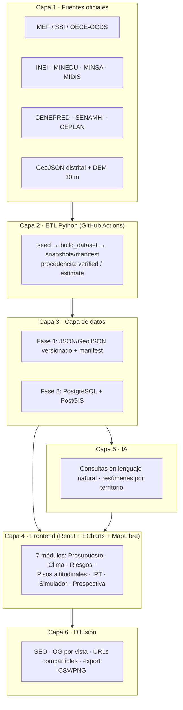

# 6. Arquitectura Funcional

QHAWAY 2.0 se organiza en seis capas funcionales desacopladas. Cada capa puede evolucionar de forma independiente entre las tres fases tecnológicas del proyecto (estático → API → nube), sin rediseñar el conjunto. El principio rector es el mismo que mantiene operativos, con costo de infraestructura de US$ 0, los ocho observatorios live del equipo proponente: **datos versionados como código, frontend estático, e inteligencia agregada en los bordes** (cliente y pipeline), no en servidores costosos de mantener — la lección directa de la caída del QHAWAY original por caducidad de dominio y hosting.

**Capa 1 — Fuentes oficiales.** El observatorio consume exclusivamente fuentes públicas verificables: MEF Transparencia Económica / Consulta Amigable para ejecución presupuestal[^arqf-mef], INVIERTE.PE/SSI para inversión pública[^arqf-ssi], la API OCDS del OECE para contrataciones[^arqf-oece], INEI (censos, ENAHO, ENDES)[^arqf-inei], MINEDU-ESCALE[^arqf-escale], MINSA-REUNIS, MIDIS-REDinforma, CENEPRED-SIGRID para escenarios de riesgo[^arqf-sigrid], SENAMHI, CEPLAN, el Portal Nacional de Datos Abiertos[^arqf-datos], organismos multilaterales (Banco Mundial, OCDE, BID, CEPAL) y, para la dimensión territorial, el GeoJSON distrital ya disponible en Proyecto INTI más el DEM SRTM/Copernicus de 30 m que sustenta el cálculo de pisos altitudinales.

**Capa 2 — ETL Python reproducible y versionado.** Cada fuente tiene un extractor propio bajo el patrón `seed → build_dataset → snapshots/manifest` ya probado en el Observatorio FONAFE[^arqf-fonafe]: los datos crudos se congelan como *snapshots* fechados en el repositorio, el *build* genera los datasets derivados de forma determinista, y un *manifest* registra fuente, fecha y procedencia de cada registro (`verified` / `estimate`). Cualquier cifra publicada es trazable a su snapshot de origen; cualquier error es reproducible y corregible. La ejecución se programa con GitHub Actions.

**Capa 3 — Capa de datos.** En Fase 1: JSON y GeoJSON estáticos versionados en Git, servidos como archivos planos con un manifest de catálogo. En Fase 2 esta capa evoluciona a PostgreSQL + PostGIS para consultas geoespaciales arbitrarias (intersección distrito × piso altitudinal, agregaciones dinámicas), manteniendo los archivos estáticos como caché de publicación: el frontend nunca depende de que el backend esté vivo.

**Capa 4 — Frontend de visualización.** SPA React + TypeScript con ECharts (series, Sankey, treemap, heatmap) y Leaflet/MapLibre GL (mapas distritales vectoriales), organizada en los siete módulos del mandato. Estado en la URL: cada vista filtrada es un enlace compartible.

**Capa 5 — Capa de IA.** Consultas en lenguaje natural sobre los datasets publicados (patrón AskBot ya demostrado en FONAFE y Defensa-Interior), resúmenes automáticos por territorio e interpretación guiada de indicadores. Arquitectura agnóstica del proveedor de LLM; toda respuesta cita el dato del manifest que la sustenta — la IA explica datos verificados, no los inventa.

**Capa 6 — Difusión.** SEO técnico (sitemap, schema.org Dataset), Open Graph por vista con imagen del gráfico, URLs compartibles con estado, y export CSV/PNG en cada visualización, para que docencia, prensa e investigación reutilicen los datos sin fricción — exactamente lo que el login obligatorio del QHAWAY original impedía.

\newpage

\newpage

## 6.1 Módulos y pregunta principal que responde cada uno

| # | Módulo | Pregunta principal |
|---|--------|--------------------|
| 1 | Presupuesto Público | ¿Cuánto se asigna (PIA/PIM) y cuánto se ejecuta realmente (devengado/girado) en cada distrito, sector y programa? |
| 2 | Cambio Climático | ¿Cuánto invierte el Perú en adaptación y mitigación, en qué territorios, y con qué ejecución real? |
| 3 | Riesgos Territoriales | ¿Qué distritos están expuestos a inundaciones, sequías, heladas y huaicos, y cómo se cruza esa exposición con la inversión? |
| 4 | Pisos Altitudinales | ¿Cuánto presupuesto llega a la puna, a la selva baja o a cada región natural de Pulgar Vidal? (diferencial único) |
| 5 | Índice de Prosperidad Territorial | ¿Qué distritos prosperan y cuáles se rezagan en educación, salud, economía y servicios básicos? |
| 6 | Simulador de Políticas | ¿Qué efecto estimado tendría priorizar educación, agua o resiliencia, bajo supuestos explícitos de literatura OCDE/BM? |
| 7 | Observatorio Prospectivo | ¿Hacia qué escenarios territoriales se dirige el Perú al 2030/2040/2050 si las tendencias continúan o cambian? |

Los módulos 1-3 reutilizan componentes ya construidos y demostrados (Perú Finanzas Públicas, Perú Riesgos); los módulos 4, 6 y 7 son desarrollo nuevo sobre patrones probados (INTI, EPI). Esta distinción —construido vs. por construir— se mantiene explícita en todo el plan de implementación.

[^arqf-mef]: MEF — Transparencia Económica / Consulta Amigable: https://apps5.mineco.gob.pe/transparencia/Navegador/default.aspx
[^arqf-ssi]: INVIERTE.PE — Sistema de Seguimiento de Inversiones (SSI): https://ofi5.mef.gob.pe/ssi/
[^arqf-oece]: OECE — API de Contrataciones Abiertas (estándar OCDS): https://contratacionesabiertas.oece.gob.pe
[^arqf-inei]: INEI — Microdatos (censos, ENAHO, ENDES): https://proyectos.inei.gob.pe/microdatos/
[^arqf-escale]: MINEDU — ESCALE, Estadística de la Calidad Educativa: https://escale.minedu.gob.pe
[^arqf-sigrid]: CENEPRED — SIGRID, Sistema de Información para la Gestión del Riesgo de Desastres: https://sigrid.cenepred.gob.pe
[^arqf-datos]: Portal Nacional de Datos Abiertos: https://datosabiertos.gob.pe
[^arqf-fonafe]: Observatorio FONAFE (patrón ETL seed→build→snapshots/manifest, live): https://unimauro.github.io/observatorio-fonafe
