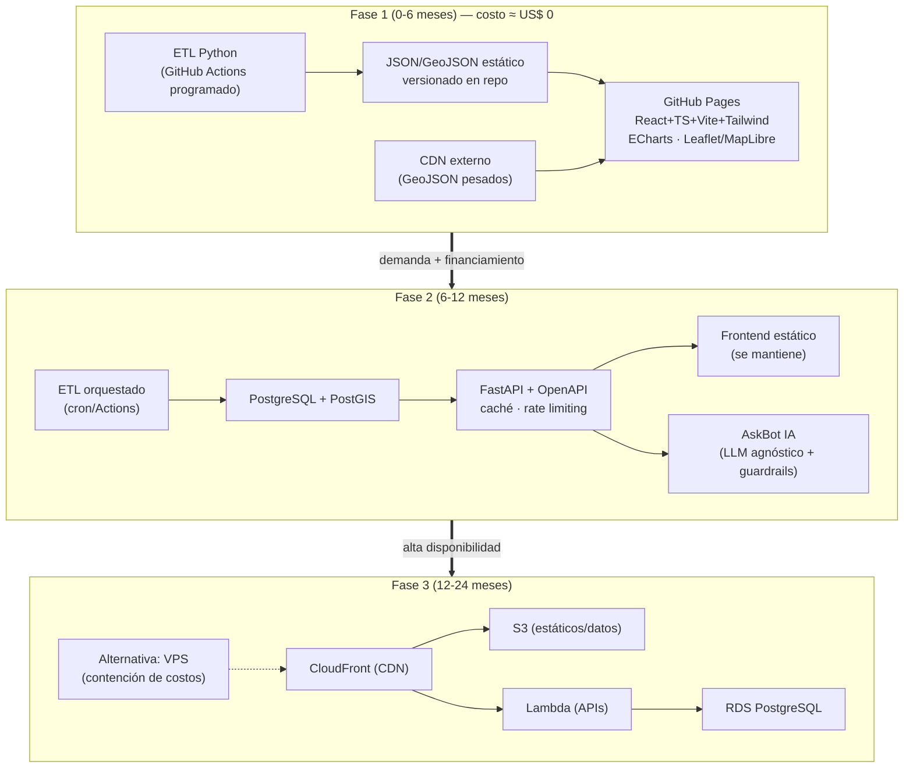

# 7. Arquitectura Tecnológica

La arquitectura de QHAWAY 2.0 responde directamente a la lección central del QHAWAY original: un observatorio con dominio y hosting pagados, sin plan de sostenibilidad, termina caído. Por ello se propone una evolución en tres fases donde **la Fase 1 tiene costo de infraestructura ≈ US$ 0** y cada fase posterior se activa solo cuando exista financiamiento y demanda comprobada. El patrón de la Fase 1 no es una hipótesis: es exactamente el que sostiene hoy los ocho observatorios live del equipo proponente (Perú Transparente, Proyecto INTI, Perú Riesgos, Observatorio FONAFE, entre otros)[^arq-portafolio].

[^arq-portafolio]: Portafolio demostrable en producción, p. ej. Perú Transparente (<https://unimauro.github.io/peru-transparente>), Proyecto INTI (<https://unimauro.github.io/proyecto-inti>) y Perú Riesgos (<https://unimauro.github.io/unimaurox-peru-riesgos>), todos servidos como sitios estáticos en GitHub Pages.

## 7.1 Fase 1 (0–6 meses): sitio estático en GitHub Pages

- **Frontend**: React 18+ con TypeScript, empaquetado con Vite y estilado con Tailwind CSS. Visualizaciones con Apache ECharts (series temporales, Sankey, treemap, heatmap, rankings) y mapas con Leaflet + MapLibre GL para teselas vectoriales distritales (1,891 distritos, GeoJSON ya disponible del Proyecto INTI).
- **Datos**: JSON estático versionado en el repositorio, generado por un ETL en Python ejecutado de forma programada con GitHub Actions[^arq-actions] contra las fuentes públicas de la sección de datos (MEF Consulta Amigable, INEI, CENEPRED, SENAMHI, etc.). Cada dataset lleva manifiesto con fecha de corte y marcado de procedencia (`verified`/`estimate`), patrón ya operativo en el Observatorio FONAFE.
- **Costo y riesgo**: la infraestructura cuesta ≈ US$ 0. El riesgo conocido son los límites blandos de GitHub Pages (~1 GB de sitio publicado y ~100 GB/mes de ancho de banda)[^arq-pages]. **Mitigación**: servir los GeoJSON y DEM derivados más pesados desde un CDN externo gratuito o de bajo costo (p. ej. jsDelivr sobre el propio repositorio, o un bucket con CDN), y publicar teselas vectoriales simplificadas por nivel de zoom.

[^arq-actions]: GitHub Actions, ejecución programada (`schedule`): <https://docs.github.com/en/actions/using-workflows/events-that-trigger-workflows#schedule>.
[^arq-pages]: Límites de uso de GitHub Pages: <https://docs.github.com/en/pages/getting-started-with-github-pages/about-github-pages#usage-limits>.

## 7.2 Fase 2 (6–12 meses): backend y API pública

Cuando el volumen de consultas cruzadas (p. ej. presupuesto × piso altitudinal × año, a demanda) supere lo razonable para JSON precalculado, se incorpora:

- **FastAPI** (Python) como capa de servicios, con documentación automática **OpenAPI**[^arq-fastapi] — la API pública es en sí misma un entregable académico: terceros podrán construir sobre los datos de QHAWAY.
- **PostgreSQL + PostGIS**[^arq-postgis] para consultas geoespaciales (intersección distrito × piso altitudinal calculada desde el DEM SRTM/Copernicus 30 m).
- **ETL orquestado** (cron/Actions) con bitácora de cargas y capa de caché para respuestas frecuentes.
- El frontend estático de Fase 1 **se mantiene**: el backend lo complementa, no lo reemplaza, preservando el costo base cercano a cero.

[^arq-fastapi]: FastAPI y especificación OpenAPI: <https://fastapi.tiangolo.com/>.
[^arq-postgis]: PostGIS, extensión geoespacial de PostgreSQL: <https://postgis.net/>.

## 7.3 Fase 3 (12–24 meses): nube gestionada con alternativa de contención

Para alta disponibilidad institucional: **AWS** con CloudFront (CDN), S3 (datos y estáticos), Lambda (APIs serverless) y RDS PostgreSQL, todo descrito como infraestructura como código (Terraform)[^arq-aws]. Conscientes de la lección del QHAWAY original, se documenta desde el día uno una **alternativa de contención de costos**: un VPS (≈ US$ 10–40/mes) corriendo FastAPI + PostgreSQL detrás de un CDN gratuito, plenamente suficiente si el financiamiento se reduce. La decisión AWS vs. VPS es reversible porque los componentes (contenedores, Terraform, dumps de PostgreSQL) son portables.

[^arq-aws]: AWS CloudFront, S3, Lambda y RDS: <https://aws.amazon.com/es/>; Terraform: <https://developer.hashicorp.com/terraform>.

## 7.4 Capa de IA: agnóstica del proveedor y con guardrails

La capa de consultas en lenguaje natural (AskBot) sigue un patrón **ya probado** en los observatorios FONAFE y Defensa-Interior: el LLM recibe como contexto el dataset curado del observatorio y responde sobre él. Principios de diseño:

- **Agnosticismo del proveedor**: una interfaz única de inferencia permite usar APIs comerciales de LLM (Anthropic, OpenAI, Google) o modelos open source (Llama, Qwen) autoalojados, como opciones técnicas intercambiables — independencia tecnológica y de costos.
- **Guardrails**: el bot responde **solo** con base en los datos del observatorio; si la información no está en el dataset, lo declara explícitamente. **Citación obligatoria**: toda respuesta indica el indicador, la fuente y la fecha de corte.
- Casos de uso: consultas territoriales ("¿cuánto presupuesto climático ejecutó la puna de Junín en 2025?"), resúmenes automáticos por distrito e informes PDF.

Se evita prometer capacidades predictivas no validadas: la IA interpreta y resume datos existentes; los escenarios prospectivos se marcan siempre como tales.

## 7.5 Stack por fase

| Componente | Fase 1 | Fase 2 | Fase 3 |
|---|---|---|---|
| Frontend | React+TS+Vite+Tailwind (Pages) | igual | igual, tras CloudFront |
| Visualización | ECharts, Leaflet/MapLibre | igual | igual |
| Datos | JSON estático (Actions) | PostgreSQL+PostGIS | RDS PostgreSQL / VPS |
| API | — | FastAPI + OpenAPI | Lambda o FastAPI en VPS |
| IA | AskBot client-side | AskBot vía API propia | igual, con caché |
| Costo infra (est.) | ≈ US$ 0 | US$ 10–50/mes (est.) | según financiamiento / VPS |

## 7.6 Seguridad y reproducibilidad

- **Solo datos públicos, sin PII**: QHAWAY 2.0 agrega información ya publicada por entidades del Estado; no recolecta datos personales de usuarios en Fase 1 (sin login — corrigiendo la barrera de registro del QHAWAY original).
- **HTTPS** en todas las fases; en Fase 2+ se añade *rate limiting* y claves de API opcionales para consumo masivo de la API pública.
- **Reproducibilidad**: todo el ETL es código Python público en GitHub; cualquier investigador puede auditar y reproducir cada cifra desde la fuente primaria. Esto es un requisito académico, no un extra.

\newpage

**Figura 7.1 — Evolución de la arquitectura, Fase 1 → 2 → 3**

\newpage
