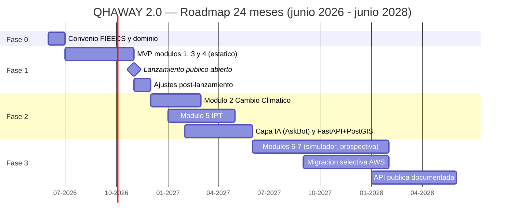

# 9. Roadmap

El roadmap de QHAWAY 2.0 está diseñado bajo un principio rector: **lanzar pronto sobre lo ya demostrado y crecer solo cuando el uso lo justifique**. A diferencia del QHAWAY original —que dependió de un dominio y un hosting pagados que caducaron y dejaron el proyecto offline[^road-wayback]—, cada fase de este plan es autosuficiente: si el financiamiento se detuviera al final de cualquier fase, la plataforma seguiría operativa con costo de infraestructura cercano a cero (GitHub Pages).

**Fase 0 — Institucionalización (mes 0-1).** Firma del convenio o resolución de Decanato que adscribe QHAWAY 2.0 a la FIEECS-UNI; definición del dominio (recuperar/registrar `qhaway.pe` o, preferentemente por sostenibilidad y autoridad institucional, un subdominio bajo `uni.edu.pe`, p. ej. `qhaway.uni.edu.pe`, que no caduca por falta de pago); kickoff con docentes y estudiantes, replicando los talleres participativos que el QHAWAY original ya practicó en 2024[^road-qhaway].

**Fase 1 — MVP público (mes 1-6).** Lanzamiento abierto (sin login, con URLs compartibles) de los módulos 1 (Presupuesto Público), 3 (Riesgos Territoriales) y 4 (Pisos Altitudinales), reutilizando los activos live del equipo (Perú Transparente, peru-riesgos, Proyecto INTI) bajo marca FIEECS-UNI. Arquitectura 100 % estática: React + ECharts + MapLibre/Leaflet + JSON versionado por ETL Python en GitHub Actions. Es la fase de menor riesgo: los componentes ya existen y están operando en producción.

**Fase 2 — Profundización analítica (mes 6-12).** Módulos 2 (Cambio Climático, continuidad del tablero "Inversión Verde" del QHAWAY original) y 5 (Índice de Prosperidad Territorial); incorporación de la capa de IA (consultas en lenguaje natural, resúmenes por territorio, patrón AskBot ya probado); backend FastAPI + PostgreSQL/PostGIS para consultas que el modelo estático no resuelve bien.

**Fase 3 — Escala y apertura (mes 12-24).** Módulos 6 (Simulador de Políticas, con supuestos siempre explícitos) y 7 (Observatorio Prospectivo); migración selectiva a AWS (CloudFront, S3, Lambda, RDS) solo de las cargas que lo requieran; API pública documentada (OpenAPI) para investigadores y periodistas de datos.

| Fase | Periodo | Entregables clave | Condición de salida |
|---|---|---|---|
| 0 | Mes 0-1 | Convenio FIEECS, dominio/subdominio, kickoff | Resolución firmada y dominio operativo |
| 1 | Mes 1-6 | MVP módulos 1, 3 y 4; lanzamiento público | Sitio live, open access, métricas de uso activas |
| 2 | Mes 6-12 | Módulos 2 y 5; AskBot IA; FastAPI+PostGIS | API interna estable; IPT v1 publicado |
| 3 | Mes 12-24 | Módulos 6-7; AWS; API pública OpenAPI | API pública con ≥1 caso de uso externo |

\newpage

\newpage

# 10. Costos Estimados

Todas las cifras de esta sección son **estimaciones referenciales a junio de 2026**, expresadas en soles (S/) y dólares (US$, tipo de cambio referencial S/ 3.70 por US$); deberán validarse contra cotizaciones y escalas vigentes de la UNI al momento de la decisión. Se presentan tres escenarios deliberadamente escalonados: el observatorio puede nacer y sostenerse en el primero, y crecer hacia los otros conforme consiga financiamiento.

| Escenario | Equipo | Infraestructura | Costo anual estimado* |
|---|---|---|---|
| A. Mínimo viable | Horas académicas + voluntariado estudiantil FIEECS | GitHub Pages (US$ 0)[^cost-pages] + dominio | S/ 700 – 2,500 (US$ 190 – 680) |
| B. Recomendado | 1 coordinador (medio tiempo) + 2 asistentes de investigación + bolsa de practicantes FIEECS | GitHub Pages + dominio + IA API | S/ 110,000 – 175,000 (US$ 30,000 – 47,000) |
| C. Pleno (financiamiento externo) | Equipo dedicado (coordinación, 2 ing./analistas, diseño y difusión parciales) | AWS + dominio + IA API + difusión | S/ 420,000 – 700,000 (US$ 115,000 – 190,000) |

\* Rangos referenciales junio 2026; no constituyen presupuesto formal.

**Escenario A — Mínimo viable (~US$ 0 de infraestructura).** Es el seguro de vida del proyecto: la Fase 1 completa puede operar con hosting gratuito en GitHub Pages, ETL en GitHub Actions (capa gratuita para repos públicos) y trabajo académico (cursos, tesis, proyección social). El único gasto rígido es el dominio; un subdominio `uni.edu.pe` lo reduce a S/ 0.

**Escenario B — Recomendado.** Desglose anual referencial: coordinador medio tiempo S/ 2,500–3,500/mes (S/ 30,000–42,000/año); 2 asistentes de investigación S/ 1,500–2,500/mes c/u (S/ 36,000–60,000/año); bolsa de 3-4 practicantes FIEECS con subvención ≥ RMV vigente (S/ 1,130/mes en 2025-2026[^cost-rmv]), parcialmente cubrible por convenios de prácticas preprofesionales (S/ 40,000–55,000/año si se asume directamente); dominio, IA y contingencias S/ 4,000–18,000/año.

**Escenario C — Pleno.** Añade dedicación exclusiva, AWS (estimado US$ 150–500/mes según tráfico, es decir S/ 6,700–22,200/año[^cost-aws]), difusión (eventos, prensa de datos, materiales) y reserva para datos/cómputo geoespacial (DEM, PostGIS gestionado).

**Costos de IA (transversal, por consumo de API).** El AskBot y los resúmenes territoriales consumen tokens de APIs comerciales de LLM; el gasto depende del tráfico real, no es fijo. Rangos estimados a precios públicos de junio 2026: uso interno/piloto US$ 10–50/mes; AskBot público con tráfico moderado US$ 50–300/mes (S/ 2,200–13,300/año); con picos de uso (coyuntura presupuestal, emergencias) hasta US$ 500/mes. Mitigaciones ya probadas en los observatorios del equipo: caché de respuestas frecuentes, límites por sesión, modelos económicos para consultas simples y opción de modelos open source autoalojados en Fase 3 para independencia del proveedor.

| Concepto recurrente | Rango anual (S/) | Nota |
|---|---|---|
| Dominio `qhaway.pe` (renovación) | S/ 150 – 250 | Vía registradores acreditados punto.pe[^cost-pe]; S/ 0 si subdominio `uni.edu.pe` |
| Hosting estático (GitHub Pages) | S/ 0 | Repos públicos; patrón probado en 8 observatorios live |
| IA por consumo (API LLM) | S/ 450 – 13,300 | Según escenario y tráfico; estimación referencial |
| AWS (solo Escenario C) | S/ 6,700 – 22,200 | US$ 150–500/mes; alternativa VPS documentada |

**La lección del QHAWAY original, convertida en regla presupuestal:** el observatorio anterior quedó offline porque la renovación de dominio y hosting no estaba asegurada más allá del primer año[^cost-leccion]. QHAWAY 2.0 adopta dos salvaguardas explícitas: (i) **toda partida de dominio/hosting se presupuesta multi-año** (renovación de `qhaway.pe` por 3-5 años por adelantado, ~S/ 450–1,250 únicos, o subdominio institucional sin caducidad); y (ii) la arquitectura degrada con gracia: si cesa todo financiamiento, el sitio estático en GitHub Pages y los datos versionados en repositorios públicos permanecen accesibles sin pago alguno.

[^road-qhaway]: QHAWAY — Observatorio del Presupuesto Público del Perú, anuncio institucional FIEECS-UNI (abril 2024): <https://fieecs.uni.edu.pe/qhaway-observatorio-del-presupuesto-publico-del-peru/>
[^road-wayback]: Snapshot del dashboard original (30-nov-2024) en Internet Archive, único acceso vigente al estar el dominio caído: <https://web.archive.org/web/20241130224308/https://dashboard.qhaway-fieecs.pe/>
[^cost-pages]: GitHub Pages es gratuito para sitios de repositorios públicos, con límites de uso blando (~100 GB/mes de banda): <https://docs.github.com/en/pages/getting-started-with-github-pages/about-github-pages>
[^cost-rmv]: Remuneración Mínima Vital de S/ 1,130 vigente desde el 01-ene-2025 (D.S. N.° 006-2024-TR); la subvención mínima de prácticas preprofesionales se referencia a la RMV (Ley N.° 28518): <https://www.gob.pe/institucion/mtpe/noticias/1067253>
[^cost-aws]: Estimación con la calculadora de precios de AWS para CloudFront + S3 + Lambda + RDS de bajo tráfico; debe recotizarse al diseñar la Fase 3: <https://calculator.aws/>
[^cost-pe]: Registro y renovación de dominios .pe a través de registradores acreditados por punto.pe (NIC .pe); tarifas según registrador: <https://punto.pe/>
[^cost-leccion]: Evidencia: el dominio `dashboard.qhaway-fieecs.pe` no resuelve a junio 2026; solo persiste el archivo en Wayback Machine: <https://web.archive.org/web/20241130224308/https://dashboard.qhaway-fieecs.pe/>
